## 2.1 条码编码与原理

### 特点：

> 具有输入速度快、准确度高、成本低、可靠性强等优点，在当今的自动识别技术中占有重要的地位。

### ==组成(如何编码)：==

> 左侧空白区	起始符	数据符	校验符	终止符	右侧空白区

==注:目前国际广泛使用的一维条码是EAN-13码和UPC条码。==

### ==识别原理：==

> 为了阅读出条形码所代表的信息，需要一套**条形码识别系统，它由条形码扫描器、放大整形电路、译码接口电路和计算机系统等部分组成。**


> 当条形码扫描器发出的光照射到黑白相间的条形码上时，其**光电转换器**接收到与**白条和黑条相应的强弱不同的反射光信号**，并转换成相应的电信号输出到**放大整形电路**，整形电路把模拟信号**转化成数字电信号**，再经**译码接口电路译成数字字符信息。**


### ==如何对应实物==

> 条形码的信息与实物通过数据库或信息系统的关联实现对应关系。每个商品或物品有唯一的条形码，扫描后的信息与数据库记录匹配，关联条形码与实物的详细信息。
>
> > 条形码的信息与实物的对应是通过数据库或信息系统的关联实现的。每个商品或物品都有一个唯一的条形码，**当条形码被扫描时，解码后的信息传递给相关的数据库或信息系统。系统通过匹配条形码信息与数据库中的记录，将条形码与实物进行对应。**这样，条形码的信息可以与实物的详细信息（如商品名称、价格、库存量等）关联起来，实现物品的追踪、管理和处理。

### ==区分生产国籍==

根据**商品条形码的前缀码**就可以区分产地，以下是一些常见的国家/地区标识码：

> - 中国大陆：以690-699作为前缀。
> - 美国和加拿大：以00-09作为前缀。
> - 日本：以490-499作为前缀。
> - 德国：以400-440作为前缀。
> - 英国：以50作为前缀。
> - 法国：以30和31作为前缀。
> - 澳大利亚：以93作为前缀。
> - 新西兰：以94作为前缀。

## 2.2 二维码编码与识别

### 区别：


### 原理：

> 二维码用某种特定的几何图形按一定规律在平面（二维方向）分布的黑白相间的图形记录数据符号信息。在代码编制上巧妙地利用构成计算机内部逻辑基础的“0”、“1”比特流的概念，使用若干个与二进制相对应的几何形体来表示文字数值信息，通过图象输入设备或光电扫描设备自动识读以实现信息自动处理。

### 特点：


### ==分类：==


### QR码的版本和信息：

> QR码共有40种版本。版本1的规格为21×21模块，版本2为25×2模块，以此类推，每一版本符号比前一版本每边增加4个模块，版40规格为177×177模块。

### ==编码步骤：==


> 生成步骤是在编码步骤的基础上进行的，它将编码后的数据转化为具体的二维码图像，并添加定位标记、格式信息和版本信息等。

### ==识别步骤：==


### ==病毒傳播方式：==

计算机或手机病毒通过扫描二维码进行传播的方式主要有两种：

1. ### **恶意二维码**：攻击者创建的二维码中包含恶意代码或链接。当用户扫描该二维码时，设备会解析并执行其中的恶意操作，如访问恶意网站、下载恶意应用程序等。
2. **漏洞二维码**：二维码扫描应用程序或操作系统本身存在安全漏洞。攻击者创建特定的二维码，利用漏洞执行恶意代码，从而控制设备或执行其他恶意操作。

> 为了防止通过扫描二维码传播的病毒威胁，可以采取以下预防措施：
>
> > - 使用受信任的二维码扫描应用程序，并确保从官方应用商店下载。
> > - 避免扫描来历不明或可疑的二维码，特别是在未知的网站或来源中发现的二维码。
> > - 不扫描无法验证来源或未经验证的二维码。
> > - 及时更新设备操作系统和应用程序，修补已知的安全漏洞。
> > - 在扫描二维码之前，检查设备的权限和设置，确保二维码不会自动执行危险操作。


## 3.1 RFID射频系统

### 特点：


### 关键技术：

> 防冲突机制
> 信息存储、检索与挖
> 定位与移动行为感知
> 安全认证与私密性保障

### RFID标准体系：


### ==系统组成：==

> ==典型的RFID系统主要由RFID读写器、电子标签、RFID中间件和用系统软件4部分构成==，一般我们把中间件和应用软件统称为应用系统。


### ==主要功能：==

> RFID系统分成**边沿系统**和**软件系统**两大部分，边沿系统主要是完成信息感知，属于硬件组件部分。软件系统完成信息的处理和用，通信设施负责整个RFID系统的信息传递。


### 感应方式：

> 从电子标签到读写器之间的通信及能量感应方式来看，RFID系统一般可以分成两类，即**电感耦合系统**和**电磁反向散射耦合系统**。电感耦合通过空间高频交变磁场实现耦合，依据的是电磁感应定律，**电感耦合方式一般适合于中、低频工作的近距离RFID系统。**电磁反向散射耦合，即雷达原理模型，发射出去的电磁波碰到目标后反射，同时携带回目标信息，依据的是电磁波的空间传播规律。**电磁反向散射耦合方式一般适合于超高频、高频、微波工作的远距离RFID系统。**


### ==分类：==

> 从电子标签到读写器之间的通信及能量感应方式来看，RFID系统一般可以分成两类，即**电感耦合系统**和**电磁反向散射耦合系统**。

### 主从原则：

> 在RFID 应用系统中，要从一个电子标签中读出数据或者向一个电子标签中写入数据，需要非接触式的读写器作为接口。读写器与电子标签的所有动作均由应用软件控制，对一个电子标签的读写操作是严格按照“主从”原则进行的。在这个“主从”原则中，**应用软件是主动方,读写器是从动方，只对应用软件的读写指令做出反应。**

### 读写器通信步骤：


### 读写器：


#### 读写器分类：

> 按工作频率分类：
>
> > 低频读写器
> >
> > 中高频读写器
> >
> > 超高频读写器
> >
> > 微波读写器等。
>
> 按外观结构分类:
>
> > 固定式
> > 读写器
> > 工业用
> > 读写器
> > 手持式读写器

### 射频标签：

> 在RFID 系统中，射频标签的复杂程度虽然远不如读写器，但是应用中标签被广泛部署，数量庞大。

#### 标签功能：


#### 分类：

> 按封装形式分类
>
> >卡形标签
> >配件型标签
> >标签型标签
> >植入型
> >标签
>
> 按能量来源分类
>
> > 有源标签
> >
> > > 又称为主动标签
> > > 有源标签工作的能量依靠自身携带的电池。
> >
> > 无源标签
> >
> > > 自身没有能源
> > > 依靠反射读写器发射的载波信号获得电能
> >
> > 半无源标签
> >
> > > 有源标签和无源标签的结合
> > > 集成电路板上也有电池作为辅助性的能量来源
>
> 按工作频率分类
>
> > 从工程角度来看，RFID技术并不是一种单一技术，它随频率改变而有所变化，RFID系统可以采用多种载波频率，但其中三种占主导地位。
>
> > 低频标签(125-135KHz)
> > 中高频标签(13.56MHz)
> > 超高频与微波标签(865-955MHz，也包含2.4GHz)
>
> 按照读写能力分类
>
> > 只读标签
> >
> > > 只能够被读取，不能够被写入数据。
> > > 标签内含有唯一标识这个标签的序列号。
> >
> > 读写标签
> >
> > > 除了提供被读写器读取数据的能力外，还允许读写器向标签中写入数据。

软件系统与中间件

> > 中间件是位于平台（硬件和操作系统）和应用之间的通用服务，这些服务具有标准的程序接口和协议。针对不同的操作系统和硬件平台，它们可以有符合接口和协议规范的多种实现。
>
> > RFID中间件扮演RFID标签和应用程序之间的中介角色，应用程序端使用中间件提供一组通用的应用程序接口（API），即能连到RFID读写器，读取RFID标签数据。

### 常见ID卡：

> EM4100卡
>
> > 载波频率为 125kHz；
> >
> > 卡向读卡器传送数据的调制方式为加载调幅；
> >
> > 卡内数据编码采用抗干扰能力强的 BPSK 相移键控方式；
> >
> > 卡向读卡器数据传送速率为 3.9kbps；
> >
> > 数据存储采用 EEPROM，数据保存时间超过 10 年；
> >
> > 数据存储容量共 64 位，包括制造商、发行商和用户代码；
> >
> > 卡号在封卡前写入后不可再更改，绝对确保卡号的唯一性和安全性；
> >
> > 芯片除封装成标准卡片形状外，还可根据应用需要封装成筹码等多种形状。
>
> T5577卡
>
> > 工作频率：125KHZ 　 
> >
> > 存储器容量：330bits,11分区，8位密码 　
> >
> > 读写距离：3-10cm 　
> >
> > 擦写寿命：大于100,000次 　
> >
> > 数据保存时间：10年 　
> >
> > 尺寸：ISO标准薄卡/厚卡/异形卡等 　
> >
> > 封装材料：PVC ABS 　
> >
> > 特点：可胶印图案，文字，LOGO 　
> >
> > 典型应用：感应式智能门锁、学校/企业一卡通系统、门禁、通道系统等

### ==工作过程：==

> (1)阅读器通过天线向周围的标签发射响应信号;
>
> (2)无源标签通过阅读器发射的无线电磁波 (即射频信号取所需能量
>
> (3)标签获取能量后解码阅读器发送的消息，并通过天线回应阅读器;
>
> (4)阅读器接收到标签发送的信息，并传输到阅读器的解码区;
>
> (5)阅读器对传输进来的射频信号进行解调和解码，然后将其编译后传输给应用层进行处理;
>
> (6)应用层判断其信息的正确性，确定标签的信号是否有效;
>
> (7)应用层根据接收到的标签信息做出相应指令并对标签进行控制处理.
>
> > 阅读器发射信号，标签感应到信号并返回标签信号;阅读器接收到标签返回的信号后，将信号传送到计算机的数据库中。

## 3.2 RFID射频识别应用-125K

### 硬件


### 射频天线

> 能够有效地向空间某特定方向辐射电磁波或能够有效的接收空间某特定方向来的电磁波。


### SL-RFMOD


> PIN2 (POWER ON): 块的电源控制。POWER=1 模块上电工作(功耗最大)POWER=0 模块下电，停止工作(功耗最小)。
>
> > PIN4(CFE): 射频场开关控制。当该管脚为“0”时射频场关闭，当该管脚为“1时射频场打开。TEMIC 卡的写卡编码是通过该管脚进的。
> > PIN5(DATA OUT):数据输出。解调出来的模块数据。RF256 卡使用 MILLER 编码，TEMIC 和 EM 系列卡片使用曼彻斯特编码。本模块支持 1/8 到 1/64 的数据带流。
>
> PIN6(CLOCK OUT): 该管脚对外输出一个 125K 的 1: 1 的方波。可以用来做解码或编码的基准时钟。
> 所有的数据 I/O 管脚需要提供上拉电阻。建议使用 4.7K 的上拉电阻。

### STC11F04E


> 工作电压：直流5~15伏(电源选择5V和大于5V两种模式)
> 1、具有电源指示；
> 2、所有I/O口已引出；
> 3、可以实现与电脑串口通信；
> 4、可以实现双串口通讯；
> 5、具有上电复位和手动复位；
>  6、电源防反接二极管；
>  7、支持STC串口下载；
>  8、双串口通讯（注：下载程序只能使用MAX232口）；
> 9、四路路LED灯（可用上位机控制，）；
> 10、可端子接线供电、可排针引电；
>  11、7805供电，输入电压范围宽

### ZigBee模块


### 主要作用：

> 通过串口与STC11F04E进行通信，获取RFID数据，并将数据通过无线发送至Zigbee协调器

### 串口SP3232


> 常见的TTL串口信号转换成RS232串口信号的电平转换芯片

### RS232转TTL

> RS323是一种通讯标准,因为高电平+15V低电平--15V电位差30V容错空间大，抗干扰能力强，一般用于工业设备直接通信电平转换芯片一般有MAX3232,SP3232TTL一般是从单片机或者芯片中发出的电平，高电平为5V（51单片机）或者3.3V（stm32）。


### 通信


### DB9


### 原理图示意图


## 3.3 考勤门禁系统设计

### 系统组成


> 1.考勤阅读器将载波信号经天线向外发送。
>
> 2.ID进入考勤阅读器的 工作范围之后，由ID卡中的电感线圈和电容组成的谐振回路接收考勤阅读器发射的载波信号，ID卡中芯片的射频接口模块由此信号感应出能量、复位信号和系统时钟，将芯片激活。
>
> 3.芯片读取控制模块将存储器中的数据经过调相编码后调制在载波上，经卡内天线回送给阅读器。
>
> 4.阅读器对接收到的回送信号进行解调、解码后送至后台计算机。
>
> 5.计算机根据卡号的合法性，针对不同应用，如判断上下班是否吃到、打开门禁等做出相应的处理和控制。

### EM4100卡

> 载波频率为 125kHz；
>
> 卡向读卡器传送数据的调制方式为加载调幅；
>
> 卡向读卡器数据传送速率为 3.9kbps；
>
> 数据存储采用 EEPROM，数据保存时间超过 10 年；
>
> 数据存储容量共 64 位，包括制造商、发行商和用户代码；
>
> 卡号在封卡前写入后不可再更改，绝对确保卡号的唯一性和安全性；
>
> 芯片除封装成标准卡片形状外，还可根据应用需要封装成筹码等多种形状。

<center class="half" style="display="flex"">
    
	
</center>

### T5577卡

> 工作频率：125KHZ 　 
>
> 存储器容量：330bits,11分区，8位密码 　
>
> 读写距离：3-10cm 　
>
> 擦写寿命：大于100,000次 　
>
> 数据保存时间：10年 　
>
> 尺寸：ISO标准薄卡/厚卡/异形卡等 　
>
> 封装材料：PVC ABS 　
>
> 特点：可胶印图案，文字，LOGO 　
>
> 典型应用：感应式智能门锁、学校/企业一卡通系统、门禁、通道系统等

<center class="half" style="display="flex"">
    
    
</center>


### 通信协议---上位机与阅读器

| 指令         | 说明     | 返回值            | 作用                 |
| ------------ | -------- | ----------------- | -------------------- |
| F6  B9 01 FE | 通信检测 | A5  6D 01         | 通信成功             |
| A5  6D FE    | 通信失败 |                   |                      |
| F6  B9 10 FE | 关射频   | A5  6D 10         | 成功                 |
| F6  B9 11 FE | 开射频   | A5  6D 11         | 成功                 |
| F6  B9 16 FE | 读取卡号 | SN:xxxxxxxxxxSTOP | xxxxxxxxxx为对应卡号 |
|              |          | NOCARDSTOP        | 未读到卡号           |
| F7 B9 01 FE  | 通信检测 | A5 7D 01          | 通信成功             |
| A5  7D FE    | 通信失败 |                   |                      |
| F7  B9 10 FE | 关继电器 | A5  7D 10         | 成功                 |

### 串口通信

> 串口通信（Serial Communications）的概念非常简单，串口按位（bit）发送和接收字节。串口可以在使用一根线发送数据的同时用另一根线接收数据。它很简单并且能够实现远距离通信。串口通信使用3根线完成，分别是地线、发送（TXD）、接收（RXD）。由于串口通信是异步的，端口能够在一根线上发送数据同时在另一根线上接收数据。


### 参数

>  串口通信最重要的参数是**波特率、数据位、停止位和奇偶校验**。对于两个进行通信的端口，这些参数必须匹配。


### 串行通信接口

> CC2530有两个串行通信接口USART0和USART1。两个USART具有同样的功能，可以分别运行于异步UART和同步SPI模式。

```c
void Init_UART1(void)
{
  PERCFG|= 0x02;		//UART1选择备用位置2
  P1SEL |= 0xC0;		//P1_6、P1_7设为外设功能
  
  U1CSR |= 0x80;		//选择UART方式
  U1GCR |= 11;		        //BAUD_E = 11
  U1BAUD |= 216;	        //BAUD_M = 216
                                //BAUD_E、BAUD_M共同作用将波特率设为115200
  U1CSR |= 0X40;		//允许接收
  EA = 1;                       //开总中断
  URX1IE = 1;		        //开UART1接收中断				
}

```

### 串口通信波特率

<h4 align="center">32MHz系统时钟时常用的波特率设置</h4>

| 波特率/（bit/s） | UxBAUD.BAUD_M | UxGCR.BAUD_E | 误差（%） |
| :--------------: | :-----------: | ------------ | --------- |
|       2400       |      59       | 6            | 0.14      |
|       4800       |      59       | 7            | 0.14      |
|       9600       |      59       | 8            | 0.14      |
|      14400       |      216      | 8            | 0.03      |
|      19200       |      59       | 9            | 0.14      |
|      28800       |      216      | 9            | 0.03      |
|      38400       |      59       | 10           | 0.14      |
|      57600       |      216      | 10           | 0.03      |
|      76800       |      59       | 11           | 0.14      |
|      115200      |      216      | 11           | 0.03      |
|      230400      |      216      | 12           | 0.03      |

> //设置波特率为57600
>
> U0GCR |= 10;
>
> U0BAUD |= 216;

### CC2530单片机数据处理


### 上位机信息处理


##  4.1 高频RFID技术

#### 非接触式IC卡原理

> IC卡也成为智能卡、智慧卡、微电路卡或微芯片卡，它将一个微电子芯片嵌入符合ISO7816标准的卡基中，做成卡片的形式。   
>
> IC与阅读器通信可以是接触的，也可以是非接触的，根据通信接口的不同，可以分为接触式IC卡和非接触式IC卡。
>
> 非接触式IC卡又称射频卡，由IC芯片、感应天线组成，封装在一个标准的PVC卡片内，芯片及天线无任何外露部分。是世界上最近几年发展起来的一项新技术,它成功的将射频识别技术和IC卡技术结合起来,结束了无源(卡中无电源)和免接触这一难题,是电子器件领域的一大突破.卡片在一定距离范围(通常为5—10mm)靠近读写器表面，通过无线电波的传递来完成数据的读写操作。

> 1、**非接触性IC卡与读卡器之间通过无线电波来完成读写操作。**二者之间的通讯频为13.56MHZ。非接触性IC卡本身是无源卡，当读写器对卡进行读写操作是，读写器发出的信号由两部分叠加组成：一部分是电源信号，该信号由卡接收后，与本身的L/C产生一个瞬间能量来供给芯片工作。另一部分则是指令和数据信号，指挥芯片完成数据的读取、修改、储存等，并返回信号给读写器,完成一次读写操作。读写器则一般由单片机，专用智能模块和天线组成，并配有与PC的通讯接口，打印口，I/O口等，以便应用于不同的领域。


> 2、非接触性智能卡内部分区
>
> > 非接触性智能卡内部分为两部分：**系统区(CDF)、用户区(ADF)**
> > 系统区：由卡片制造商和系统开发商及发卡机构使用。
> > 用户区：用于存放持卡人的有关数据信息。

### 优点

> (1)可靠性高
> 非接触式IC卡与读写器之间无机械接触，避免了由于接触读写而产生的各种故障。
> (2)操作方便
> 由于非接触通讯，读写器在10CM范围内就可以对卡片操作，所以不必插拨卡，非常方便用户使用。非接触式卡使用时没有方向性，卡片可以在任意方向掠过读写器表面，既可完成操作，这大大提高了每次使用的速度。
> (3)防冲突
> 非接触式卡中有快速防冲突机制,能防止卡片之间出现数据干扰，因此，读写器可以“同时”处理多张非接触式IC卡。这提高了应用的并行性，,无形中提高系统工作速度。
> (4)加密性能好

### 概述：

> 低频（125k—134.2K）、高频（13.56Mhz）、超高频（433MHz、868—950MHz），微波（1GHz 以上，常见的规格有 2.45GHz、5.8GHz）

> **高频RFID**是RFID技术中的一种，**工作频率主要有6.75M、13.56M、27.125M。**
>
> 在该频率的感应器不再需要线圈进行绕制，可以通过腐蚀或者印刷的方式制作天线。感应器一般通过负载调制的方式进行工作。也就是通过感应器上的负载电阻的接通和断开促使读写器天线上的电压发生变化，实现用远距离感应器对天线电压进行振幅调制。如果人们通过数据控制负载电压的接通和断开，那么这些数据就能够从感应器传输到读写器。

### 通信原理

> 电感耦合方式
>
> > 低频和高频RFID基本都采用电感耦合方式进行工作。在这种工作方式中，读写器和电子标签线圈天线都相当于电感，电感线圈产生交变磁场，使读写器与电子标签之间相互耦合，构成了电感耦合方式的能量和数据传输。同时，线圈产生的电感和射频电路中的电容组合在一起，形成谐振电路，**读写器和电子标签的射频前端都采用谐振电路**。

<center class="half" style="display="flex"">
    
    
</center>

### 系统组成

> 以典型的IC卡MIARE 1为例，说明电子标签获得能量的整个过程。读卡器向IC卡发送一组固定频率的电磁波，标签内有一个LC串联谐振电路，其谐振频率与读写器发出的频率相同，这样当标签进入读写器范围时便产生电磁共振，从而使电容内有了电荷，在电容的另一端接有一个单向通的电子泵，将电容内的电荷送到另一个电容内储存，当储存积累的电荷达到2V时，此电源可作为其他电路提供工作电压，将标签内数据发射出去或接收读写器的数据。


### 高频RFID系统协议

> 高频HF的射频识别系统通过天线线圈电感耦合来传输能量，通过电感耦合的方式磁场能量下降较快。磁场信号具有明显的读取区域边界。主要应用于1米以内的人员或物品的识别。遵循两种协议：**ISO/IEC14443（A、B）协议，ISO/IEC15693协议。**

### 通信流程

高频RFID系统读写器与IC卡通信过程如下图所示：


> （1）复位应答：
>
> （2）防冲突机制：
>
> （3）选择卡片(Select Tag）：
>
> （4）三次互相确认：

### 高频RFID防冲突机制

> 阅读器防冲突过程如下：
>
> > 1）首先由PCD发送REQA（对TYPE A类卡请求）命令或唤醒命令，使卡进入准备状态。这两个命令的差别是：REQA命令使卡从闲置状态进入准备状态，而唤醒命令使卡从暂停状态进入准备状态。
> > 2）PICC接收到命令后，所有处在PCD电磁场范围内的PICC同步发出ATQA应答，说明本卡UID的大小(1、2或3)，之后进入准备状态，执行防冲突循环操作。
> > 3）PCD通过发送防碰撞和选择命令执行防冲突循环操作，命令格式如下所示：
> >
> > 
> >
> > SEL为指令码，其代码为93、95或97，分别代表选择UID CL1、UID CL2或UID CL3；NVB表示本命令的长度，NVB的前半字节表示字节数，后半字节表示位数。

### 分类

> 目前有多种类型的非接触式IC卡，它们按照遵从的不同协议大体可以分为三类，各类IC卡特点及工作特性如表所示，PHILIPS的Mifare 1卡属于PICC卡，该类卡的读写器称为PCD。

| IC卡 | 读写器 |    国际标准     | 工作频率       |           读写距离           |
| :--: | ------ | :-------------: | -------------- | :--------------------------: |
| CICC | CCD    | ISO/IEC (10536) | 密耦合(0~lcm)  |           0~30MHz            |
| PICC | PCD    | ISO/IEC(14443)  | 近耦合(7~10cm) | <135kHz，6.75MHz,(13.56 MHz) |
| VICC | VCD    | ISO/IEC(15693)  | 疏合(<lm)      |          27.125 MHz          |

### Mifare技术

>    Mifare 1（S50）卡电子标签，Mifare卡是目前世界上使用数量最大的一种感应式智能IC卡，拥有13.56MHz非接触性辨识技术。Mifare非接触智能卡之卡片阅读机的标准读卡距离是2.5至10厘米。在北美，由于FCC（电力）的限制，读卡距离则在2.5厘米左右。
>
>    其中，存储介质：EEPROM；存储容量：分为16个扇区（扇区0-15），每个扇区有4个块（Block）块0、块1、块2和块3，每个块有16个字节，即1024×8位字长（1KB）。


> 第0扇区的块0(即绝对地址0块)，它用于存放厂商代码，已经固化，不可更改。
> 每个扇区的块0、块1、块2 为数据块，可用于存贮数据。

### 块功能详解


> 地址：扇区0块0。
>
> 内容：第0-3个字节为卡序列号SN，第4个字节为序列号的校验码；第5-15个字节为厂商数据；

### 数据块

> 每扇区3个数据块（扇区0只有2个），每块16字节。可由区尾块中的存取控制位（access bits）配置为：
>
> A）读写块：用作一般的数据保存，可用读/写命令直接读/写整个块。
>
> B）值块：用作数值块，可以进行初始化值、加值、减值、读值的运算。 
>
> C）通常数据块中的数据都是需要保密的数据，对这些数据的操作需符合该块存取条件的要求和通过该扇区的密码认证。

### 区尾块


> 每个扇区的块3为区尾（Sector Trailer）块：KEY A（6 字节）+ Access bits（4字节）+ KEY B（6字节），KEY A和KEY B读时返回0。


## ==4.2 阶段性知识点总结==

### 条形码技术

#### 原理：

> 一维条形码是由光反射率不同、宽度不同、密集程度不同的黑条和白条，按照一定的规则编码成的，用以表达一组信息的符号。


> 现在较通用的一维条形码有128码、UPC码、39码、EAN，和专门用在图书管理的国际标准书号（ISBN）等。

#### 条形码编码原理

> 一个完整的条形码是有其严格的组成顺序的。每个条形码的组成部分都有其特殊作用。一般来说，一维条形码的组成顺序从左到右是：**前段静空区、开始码、数据信息区、中间分割符**（有些条形码有但是不一定都有，主要提供给 EAN 码）、**校验码**（如果所用条形码编码本身已有校验功能，不一定需要）、**结束码、后端静空区。**


#### 条形码编码技术规范

> 一般来说，每一种条形码规范会规定好下列七个方面：
>
> 1.符号种类(Symbology Type) （分散式和连续式）
> 2.字元组合
> 3.细线条的宽度
> 4.粗细线条的数目
> 5.不变或可变长度
> 6.字元密度
> 7.自我检错能力 

#### 条码识别系统


#### EAN-13编码

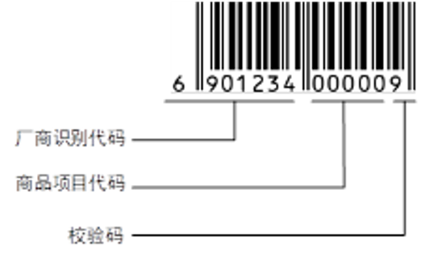

> 690~695：产地为中国

### 二维码技术

#### 分类

> 二维码可以分为**堆叠式/行排式**二维条码和**矩阵式**二维条码：

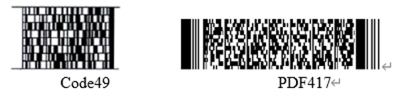


#### 特点

> 以常见的QR码为例，对比一维码，有如下特性：
>
> > 1）存储大容量信息。
> > 2）在小空间内打印。
> > 3）对变脏和破损的适应能力强。
> > 4）可以从任意方向读取。
> > 5）支持数据合并功能。
> > 6）容错能力强。

#### 编码原理

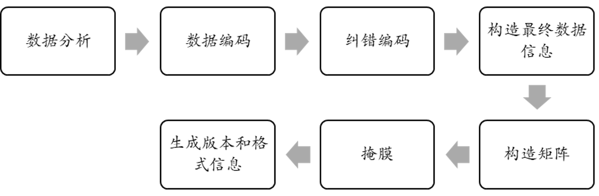

#### 二维码结构图

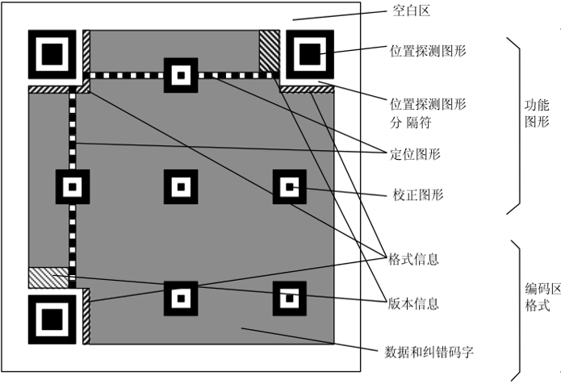

### 低频RFID

#### 系统组成

> 典型的RFID系统主要由**RFID读写器、电子标签、RFID中间件和应用系统软件**4部分构成，一般我们把中间件和应用软件统称为应用系统。


> RFID系统分成**边沿系统**和**软件系统**两大部分，边沿系统主要是完成信息感知，属于硬件组件部分。软件系统完成信息的处理和应用，通信设施负责整个RFID系统的信息传递。


#### 感应方式

> 从电子标签到读写器之间的通信及能量感应方式来看，RFID系统一般可以分成两类，即**电感耦合系统**和**电磁反向散射耦合系统**。电感耦合通过空间高频交变磁场实现耦合，依据的是电磁感应定律，电感耦合方式一般适合于中、低频工作的近距离RFID系统。电磁反向散射耦合，即雷达原理模型，发射出去的电磁波碰到目标后反射，同时携带回目标信息，依据的是电磁波的空间传播规律。电磁反向散射耦合方式一般适合于超高频、高频、微波工作的远距离RFID系统。
>
> 由于低频RFID系统的波长更长，能量相对较弱，因此主要依赖近距离的感应来读取信息，电感耦合主要应用在低频(LF)、中频(HF)波段。由于高频率的波长较短，能量较高，因此，读写器天线可以向标签辐射电磁波，部分电磁波经标签调制后反射回读写器天线，经解码以后发送到中央信息系统接收处理，电磁反向散射耦合主要应用在高频(HF)、超高频(UHF)波段。


#### 读写器遵守主从原则

> 在RFID 应用系统中，要从一个电子标签中读出数据或者向一个电子标签中写入数据，需要非接触式的读写器作为接口。读写器与电子标签的所有动作均由应用软件控制，对一个电子标签的读写操作是严格按照“主从”原则进行的。在这个“主从”原则中，应用软件是主动方,读写器是从动方，只对应用软件的读写指令做出反应。

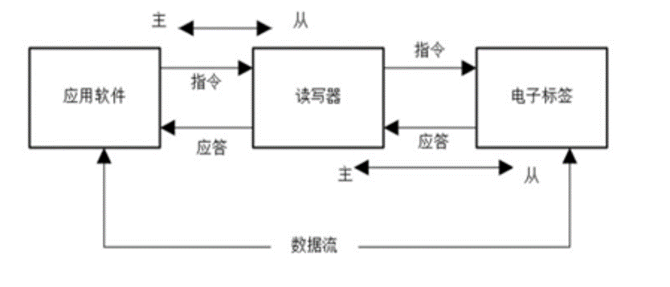

#### 射频标签分类

> 按能量来源分类

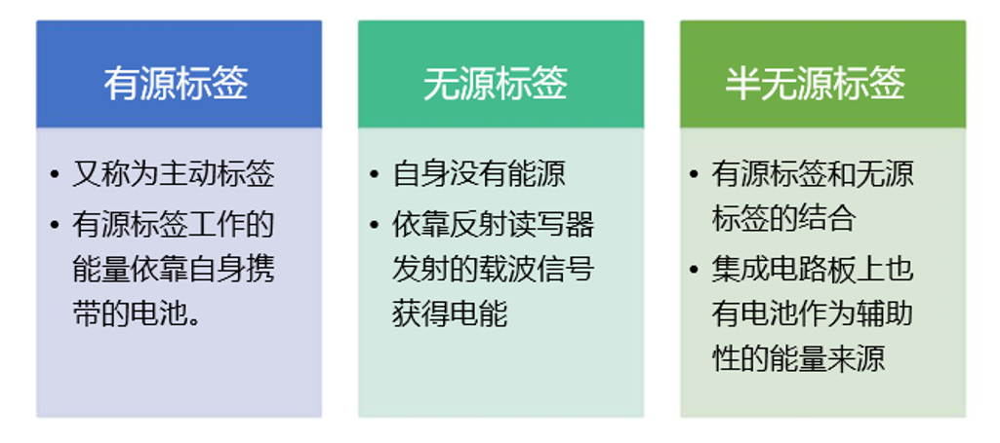

> 按工作频率分类
>
> > 从工程角度来看，RFID技术并不是一种单一技术，它随频率改变而有所变化，RFID系统可以采用多种载波频率，但其中三种占主导地位。

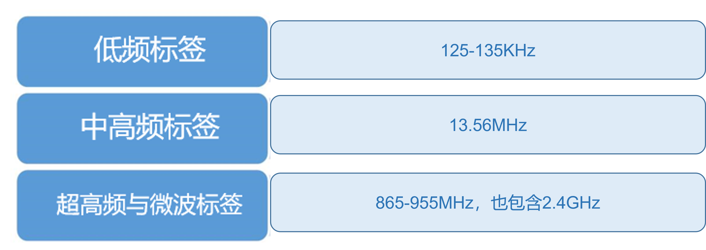

> 按照读写能力分类

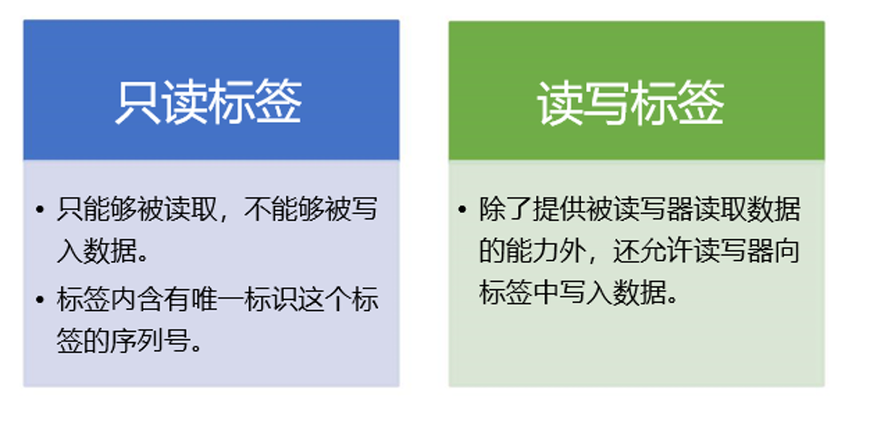

### 高频RFID

#### 概述

> ​    高频RFID是RFID技术中的一种，工作频率主要有6.75M、13.56M、27.125M。
>
> > 在该频率的感应器不再需要线圈进行绕制，可以通过腐蚀或者印刷的方式制作天线。感应器一般通过负载调制的方式进行工作。也就是通过感应器上的负载电阻的接通和断开促使读写器天线上的电压发生变化，实现用远距离感应器对天线电压进行振幅调制。如果人们通过数据控制负载电压的接通和断开，那么这些数据就能够从感应器传输到读写器。


#### 通信原理

> 电感耦合方式
>
> > 低频和高频RFID基本都采用电感耦合方式进行工作。在这种工作方式中，读写器和电子标签线圈天线都相当于电感，电感线圈产生交变磁场，使读写器与电子标签之间相互耦合，构成了电感耦合方式的能量和数据传输。同时，线圈产生的电感和射频电路中的电容组合在一起，形成谐振电路，读写器和电子标签的射频前端都采用谐振电路。


### 超高频RFID

#### UHF RFID系统概述

> ​    超高频（Ultra High Frequency, UHF）指频率为300～3000MHz，波长在1m～1dm的无线电波。该波段的无线电波又称为分米波。这个频段的无线电波常用于广播电视领域。比如我国广播电视在这个频段使用470到806MHz。这个频段的电波可以用小而短的天线作收发，适合移动通信。
>
> ​    超高频射频识别系统中，波长越长，路径损耗越小。本任务介绍的超高频射频识别系统基于ISO 18000-6标准,频率主要位于915MHz附近。

>    UHF RFID系统主要应用于**同时对多个电子标签进行操作、需要较长的读写距离、需要高速读写**的场合。
>
>    超高频电子标签为**无源电子标签**。读写器天线的辐射场为无源电子标签提供射频能量。
>
>    超高频电子标签的典型参数为**无线读写距离**、**是否支持多标签同时读写、是否适合高速物体识别、电子标签的价格以及数据存储容量等**。
>
>    超高频电子标签的数据存储容量一般限定在**2Kbit以内**，从技术及应用的角度来说，超高频电子标签并不适合作为大量数据的载体，其主要功能在于标识物品并完成无接触的识别过程。。

#### 系统组成及原理

>    UHF RFID系统包括有**读写器、电子标签、天线**以及**上层应用接口程序**等部份。
>
>    **工作原理为PC机通过RS232接口远程控制读写器。读写器接到命令后，通过天线发送射频命令实现对标签的操作，同时接收标签返回的数据。标签靠其天线获得能量，并由芯片控制接收、发送数据。标签本身无电源，靠读写器的射频场获得能源。**
>
>    UHF RFID读写器与标签的通信采用**电磁反向散射原理**。超高频RFID系统特点是距离远、多标签阅读能力强。


#### 电磁反向散射原理

>    雷达发射出来的电磁波，一面在天气中传播，一面又不断被天气本身和大气中的水冷凝结物所散射、吸收。电磁波在传播中遇到水滴时，在水滴内部就感生出偶极子标荡，入射的电磁波能量，一部分被水滴吸收，被水滴吸收的电磁波只有其中的一部分按照入射波的方向返回到雷达天线，这一部分散射叫做反向散射，又称反射。反射回来的信号，被天线接收后，经过放大和处理，即可获得目标的有关信息。

>    一个目标反射电磁波的频率由反射横截面来确定。反射横截面的大小与一系列的参数有关，如目标的大小、形状和材料，电磁波的波长和极化方向等。由于目标的反射性能通常随频率的升高而增强，所以RFID反向散射耦合方式采用特高频和超高频，应答器和读写器的距离大于1 m。

#### 超高频RFID读写器特点

> •非接触
> •读写距离远
> •适应物体高速运动性能好
> •操作方便
> •防冲突
>
> > 用途极其广泛。在智能停车场管理、仓库物资进出监管和识别管理、车牌防伪识别管理、行李包裹识别管理和码头集装箱管理等有广泛应用。

#### 标签结构及其存储结构

> 不同频段标签芯片的基本结构类似，一般都包含**射频前端、模拟前端、数字基带和存储器单元**等模块。
>
>   射频前端模块主要用于对射频信号进行整流和反射调制；
>   模拟前端模块主要用于产生芯片内所需的基准电源和系统时钟，进行上电复位等；
>   数字基带模块主要用于对数字信号进行编码解码以及进行防碰撞协议的梳理等；
>   存储器单元用于信息存储。

### NFC识别技术

#### 近场通信传输速度

> 近场通信是一种短距离高频无线电技术，在**13.56MHz**频率运行于**10**厘米距离内。其传输速度有**106 Kbit/秒、212 Kbit/秒**或者**424 Kbit/秒**三种。目前近场通信已通过成为ISO/IEC IS 18092国际标准、ECMA-340标准与ETSI TS 102 190标准。


#### 模块组成

> ​       NFC模块由**NFC芯片和NFC天线**组成。NFC芯片具有相互通信功能、计算能力，并具有加密和解密模块（SAM），NFC天线是一种**近场耦合天线，耦合方式是线圈磁场耦合。**


#### NFC与RFID的区别

> NFC技术起源于RFID，但是与RFID相比有一定的区别，主要包括以下内容：
>
> （1）工作频率：NFC--13.56MHz；RFID--有低频、高频（13.56MHz）及超高频。 
>
> （2）工作距离：NFC的工作距离理论上为0～20cm，RFID具有不同的频率，其工作距离从几厘米到几十米不等。 
>
> （3）工作模式：NFC同时支持读写模式和卡模拟模式。在RFID中，读卡器和非接触卡是独立的两个实体，不能相互切换。 
>
> （4）点对点通信：NFC支持点对点通信模式，RFID不支持点对点模式。
>
> （5）应用领域： RFID更多地被应用在生产、物流、跟踪、资产管理上，NFC则在门禁、公交车、手机支付等领域发挥巨大的作用。 
>
> （6）标准协议：NFC的底层通信技术兼容高频RFID技术（13.56MHz）的底层通信技术标准，因此在13.56MHz RFID的应用领域中，同样可以使用NFC技术来代替。

#### 近场通信的技术原理

> 近场通信的技术原理非常简单，它可以通过**主动与被动**两种模式交换数据。
> （1）在被动模式下，启动近场通信的设备，也称为发起设备（主设备），在整个通信过程中提供射频场(RF-field)。它可以选择106 kbps、212 kbps或424 kbps其中一种传输速度，将数据发送到另一台设备。另一台设备称为目标设备（从设备），不必产生射频场，而使用负载调制技术，以相同的速度将数据传回发起设备。
> （2）在主动模式下，发起设备和目标设备都要产生自己的射频场，以进行通信。

#### NFC的两种通信模式

##### 1）主动模式：

> 每台设备要向另一台设备发送数据时，都必须产生自己的射频场。如图所示，发起设备和目标设备都要产生自己的射频场，以便进行通信。这是对等网络通信的标准模式，可以获得非常快速的连接设置。


##### 2)被动模式:

> 启动NFC通信的设备，也称为NFC发起设备(主设备)，在整个通信过程中提供射频场。将数据发送到另一台设备。另一台设备称为NFC目标设备 (从设备)，不必产生射频场，而使用负载调制技术，即可以相同的速度将数据传回发起设备。


> 移动设备**主要以被动模式操作**，可以**大幅降低功耗**，并延长电池寿命。在一个应用会话过程中，NFC设备可以在发起设备和目标设备之间切换自己的角色。利用这项功能，电池电量较低的设备可以要求以被动模式充当目标设备，而不是发起设备。
>
> 目前，常见的NFC工作模式就是被动模式。例如，刷手机乘公交、购物等，这些都是将NFC终端则模拟成一张卡片，它只在其他设备发出的射频场中被动响应。主动模式常见于读取NFC标签信息等，双向模式多用于信息交换，例如交换名片。


#### NFC的三种操作模式

> 基于主动通信和被动通信，NFC终端主要有三种工作模式：

##### 1）**读卡器模式**

> 在该模式下NFC终端作为一个读卡器，发出射频场去识别和读/写别的NFC设备信息。比较常见的应用就是公交卡余额的查询、充值等操作。数据在NFC芯片中，可以简单理解成“刷标签”。


##### 2）**卡模式**

> 这一模式其实就是替代大量的 IC 卡。其本质在于运用程序去模拟卡的功能，用软件去替代实物。将相应IC卡中的信息凭证封装成数据包存储在支持NFC的外设中。这个模式NFC终端则被模拟成一张卡，它只在其他设备发出的射频场中被动响应，被读/写信息。


##### 3）**双向模式**

> 在此模式下NFC终端双方都主动发出射频场来建立点对点的通信。相当于两个NFC设备都处于主动模式。用于数据交换，只是传输距离较短，创建速度较快，传输速度也很快，功耗低。主要用途在于蓝牙配对、Wi Fi 配对、手机间数据传递等。

### CPU卡识别技术

#### 特点

> ​    非接触式CPU卡卡内集成电路中包括**中央处理器（CPU）、只读存储器（ROM）、随机存取存储器(RAM)、电可擦除可编程只读存储器（EEPROM）以及片内操作系统COS**等，犹如一台超小型电脑。

> **优点：**
>
> 信息量大
> 防伪安全性高
> 可脱机作业
> 可多功能开发

> 非接触式CPU卡采用了无线传输的方式，工作在**13.56MHz**


#### CPU卡与IC卡关系和区别

> CPU卡是IC卡大家族中的一员。IC卡是集成电路卡（Integrated Circuit Card）的简称，是镶嵌集成电路芯片的塑料卡片，其外形和尺寸都遵循国际标准（ISO）。芯片一般采用不易挥发性的存储器（ROM、EEPROM）、保护逻辑电路、甚至带微处理器CPU。CPU卡是含有微处理器的IC卡，**拥有独立的CPU处理器和芯片操作系统**，可以更灵活地支持不同的应用需求，提高了系统的安全性。
> 按照嵌入集成电路芯片的形式和芯片类型的不同IC卡大致可分为接触式，非接触式、双界面卡。如图所示：


> 数据结构方面，前面学习过的IC卡，它的要点在于卡的存储结构，如制**造商区、密码区、数据控制区、数据区（应用区）**等等。而CPU卡，要关注文件系统的结构：主文件（MF，相当于DOS文件系统的根目录）、专用文件（DF，相当于DOS文件系统的目录，可以有多层）、基本文件（EF，相当于DOS文件系统的文件）。

> CPU卡的基本文件类型有**透明（二进制）文件、（定长与不定长）线性记录文件和循环记录文件**三类，由于COS内部控制的需要，也派生出一些特定的“变种”——复位应答文件、口令文件、密钥文件、DIR文件、SFI文件……

> 读取方面，纯粹的存储卡是可以自由读取的；逻辑加密卡的访问控制，需要掌握特定的卡的口令控制、认证控制、特定的数据控制标志字节等，可通过调用函数直接完成的，需要熟悉调用参数。
> 而**CPU卡的访问控制，是在建立文件时定义**的，比如读、写、更改分别是否需要认证，用哪个密钥，是否需要口令，是否需要MAC验证等等。CPU卡除了设备命令（测卡、上下电、选卡座等）和卡的复位命令以外，所有卡命令都是通过一个通用的命令函数执行的，可参考COS手册。

#### CPU卡的射频识别原理

> CPU卡的射频识别原理是**读卡器向电子标签发送命令**。经电子标签的天线进入射频模块。信号在射频模块中被发现后，被传送到操作系统中。操作系统程序模块是以代码的形式写入ROM的。并在芯片生产阶段写入芯片之中，操作系统的任务是对电子标签完成指令序列的控制、文件管理及加密算法。

> CPU卡射频识别设备工作于**13.56MHz**频段，系统通过天线线圈电感耦合来传输能量，通过电感耦合的方式磁场能量下降较快。磁场信号具有明显的读取区域边界。主要应用于1米以内的人员或物品的识别。

#### COS片内操作系统

> COS的全称是Chip Operating System(片内操作系统)，它一般是紧紧围绕着它所服务的智能卡的特点而开发的。首先，COS是一个专用系统而不是通用系统。即：**一种COS一般都只能应用于特定的某种(或者是某些)智能卡，不同卡内的COS一般是不相同的，但大部分都遵循着同一个国际标准。**
>
> 其次，与那些常见的微机上的操作系统相比较而言，<u>COS在本质上更加接近于监控程序、而不是一个通常所谓的真正意义上的操作系统</u>，COS所需要解决的主要还是**对外部的命令如何进行处理、响应的问题**，并不涉及到共享、并发的管理及处理。由于不可避免地受到了智能卡内微处理器芯片的性能及内存容量的影响，因此，COS在很大程度上不同于通常所能见到的微机上的操作系统(例如DOS、UNIX等)。

## 5.1 超高频RFID技术应用

### ==超高频RFID系统概述==

> ​    超高频（Ultra High Frequency, UHF）指频率为**300～3000MHz**，波长在1m～1dm的无线电波。该波段的无线电波又称为分米波。这个频段的无线电波常用于广播电视领域。比如我国广播电视在这个频段使用470到806MHz。这个频段的电波可以用小而短的天线作收发，适合移动通信。
>
> ​    超高频射频识别系统中，波长越长，路径损耗越小。本任务介绍的超高频射频识别系统基于ISO 18000-6标准,频率主要位于915MHz附近。

>   UHF RFID系统主要应用于**同时对多个电子标签进行操作、需要较长的读写距离、需要高速读写**的场合。
>
>   超高频电子标签为**无源电子标签**。读写器天线的辐射场为无源电子标签提供射频能量。
>
>   超高频电子标签的典型参数为**无线读写距离、是否支持多标签同时读写、是否适合高速物体识别、电子标签的价格以及数据存储容量等。**
>
>   超高频电子标签的数据存储容量一般限定在**2Kbit以内**，从技术及应用的角度来说，超高频电子标签并不适合作为大量数据的载体，其主要功能在于标识物品并完成无接触的识别过程。

#### 系统组成及原理

>  UHF RFID系统包括有**读写器、电子标签、天线以及上层应用接口程序**等部份。
>
>   **工作原理为PC机通过RS232接口远程控制读写器。读写器接到命令后，通过天线发送射频命令实现对标签的操作，同时接收标签返回的数据。标签靠其天线获得能量，并由芯片控制接收、发送数据。标签本身无电源，靠读写器的射频场获得能源。**
>
>   UHF RFID读写器与标签的通信采用**电磁反向散射原理**。超高频RFID系统特点是距离远、多标签阅读能力强。


#### 电磁反向散射原理

>    雷达发射出来的电磁波，一面在天气中传播，一面又不断被天气本身和大气中的水冷凝结物所散射、吸收。电磁波在传播中遇到水滴时，在水滴内部就感生出偶极子标荡，入射的电磁波能量，一部分被水滴吸收，被水滴吸收的电磁波只有其中的一部分按照入射波的方向返回到雷达天线，这一部分散射叫做反向散射，又称反射。反射回来的信号，被天线接收后，经过放大和处理，即可获得目标的有关信息。
>
>    一个目标反射电磁波的频率由反射横截面来确定。反射横截面的大小与一系列的参数有关，如目标的大小、形状和材料，电磁波的波长和极化方向等。由于目标的反射性能通常随频率的升高而增强，所以RFID反向散射耦合方式采用特高频和超高频，应答器和读写器的距离大于1 m。

#### 应答器的能量供给

> 阅读器开始工作之后，通过天线先向空间发送860～960 MHz频率范围的载波，激活标签。然后开始发送带调制的命令信息到标签（TAG），可以采用ASK调制，脉冲间隔编码，通讯速率26.7到128KBIT/S。在高频范围内的标签收到阅读器发出的高频载波信号，标签天线接收到特定的电磁波，天线就会产生感应电流，在经过整流电路时，激活电路上的微型开关，给标签供电。

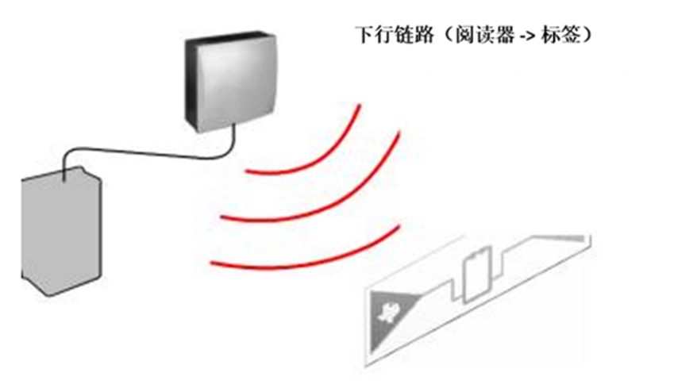

#### 应答器与读写器的数据传输

> 标签上的电子线路，将根据阅读器发出信息，通过ASK或者PSK 耦合方式进行调制，FM0等编码方式，向阅读器反馈相关信息。相互认证通过之后，阅读器会向电子标签发出读、写、锁定、kill、盘存等操作指令。

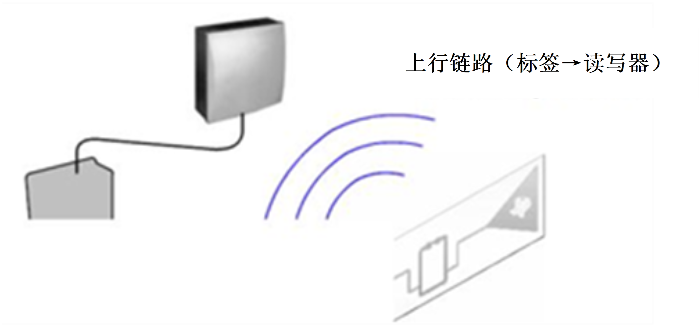

#### ==UHF RFID应用领域==

>    超高频RFID市场应用场景相当广阔，具有能一次性读取多个标签、识别距离远、传送数据速度快，可靠性和寿命高、耐受户外恶劣环境等优点。可用于资产管理、生产线管理、供应链管理、仓储、各类物品防伪溯源(如烟草、酒类、医药等)、零售、车辆管理等等。


### 超高频RFID系统的协议

> ISO/IEC 18000-6标准的第六部分是工作频率在860-960MHZ的空中接口通信技术参数。标准包含三种通信模式:**TYPE ATYPE B，TYPE C**。阅读器应支持三种模式，并能在三种模式之间进行切换。应答器则至少支持其中一种模式，应答器向阅读器的信息传输基于反向散射工作方式。

#### Type A协议

> TypeA协议的通讯机制是基于一种“**阅读器先发言**”的，即基于阅读器的命令与应答器的回答之间交替发送的机制。
> 通讯中的数据信号的编码和调制方法定义为:
>
> > (1)阅读器到应答器之间的通讯传输阅读器发送的数据采用ASK(制载波幅度)进行调制，调制深度是**30%**(误差不超过3%);数据编码采用脉冲宽度编码来编码数据。即通过定义下降沿之间的不同宽度来表示不同数据信号。
> > (2)应答器到阅读器之间的传输连接应答器通过反向散射给阅读器来传输信息;数据编码采用FMO编码，数据速率是40kbps。
> > (3)防冲突采用**时隙ALOHA算法**

#### Type B协议

> Type B协议和TypeA协议在很多领域都是相似的
>
> > (1)阅读器到应答器之间的通讯采用的调制方式也是ASK，而调制深度为**30.5%或者100%**;编码方式为FMO。
> > (2)应答器到阅读器之间的传输采用反向散射的方式将调制的信息回传给说读器，调制方式为ASK;编码方式为FMO。
> > (3)防冲突采用**自适应二进制树算法**

#### Type c协议

> Type C协议是基于一种“阅读器先发言”的通讯机制，即基于阅读器的命令与应答器的回答之间交替发送的机制。
>
> > 电子标签从阅读器发出的电磁波中获取能量，阅读器通过调制发送的载波给标签发送信息并且给标签发送无调制的载波并通过接收标签的后向散射获取标签返回的信息。由此可见阅读器和电子标签之间的通信是半双工的，标签在后向散射的时候不获取阅读器的指令。由于是短距无线通信，为了使得标签解调的方便，阅读器到标签之间的通信方式主要是幅度调制，而电子标签的后向散射是通过调制阅读器的无调制载波来返回信息，**主要的调制方式是<u>幅度调制或者是相位调制</u>**

### ==常用超高频RFID系统阅读器和标签==

#### ==读写器==

> 读写器没有一个确定的模式。根据数据管理系统的功能和设备制造商的生产习惯，读写器具有各种各样的结构和外观形式。超高频RFID读写器有多种类型如固定式、手持式、桌面式等。


#### 超高频RFID读写器特点

> **非接触**
> **读写距离远**
> **适应物体高速运动性能好**
> **操作方便防冲突**
>
> > 用途极其广泛。在智能停车场管理、仓库物资进出监管和识别管理、车牌防伪识别管理、行李包裹识别管理和码头集装箱管理等有广泛应用。

#### 超高频标签

> 超高频标签芯片制造商主要有：
>
> ==Alien、IMPINJ、TI、NXP、STM等==
>
> ​    标签制造商通过设计天线并制作封装而生产出标签。不同厂商的标签天线规格不同，标签的封装是各种各样，下表是几种标签的外形。标签天线规格不同，同时天线的谐振频率点也不完全相同，这样当使用固定频点的读写器读一类标签时的效果很好，而读另一类标签的效果却会很差。

#### 标签结构及其存储结构

> 标签结构如图所示，由**标签天线**和**芯片**两部分组成。

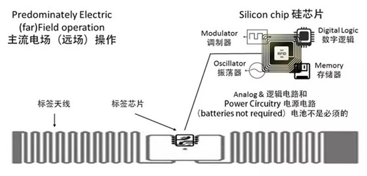

#### 标签结构及其存储结构

> 不同频段标签芯片的基本结构类似，一般都包含**射频前端、模拟前端数字基带和存储器单元等模块。**
> 射频前端模块主要用于对射频信号进行整流和反射调制:模拟前端模块主要用于产生芯片内所需的基准电源和系统时钟，进行上电复位等:
> 数字基带模块主要用于对数字信号进行编码解码以及进行防碰撞协议的梳理等;
> 存储器单元用于信息存储。

#### 标签响应流程

> 读写器发射电磁波到标签
> 标签从电磁波中提取工作所需要的能量
> 标签使用内部集成电路芯片存储的数据调制并反向散射一部分电磁波到读写器
> 读写器接收反向散射电磁波信号并解调以获得标签的数据信息。即电子标签通过反向散射调制技术给读写器发送信息。

## 5.2ETC不停车收费系统开发

### 系统概述

> ETC( Electronic Toll Collection)不停车收费系统是目前世界上最先进的路桥收费方式。该系统通过安装在车辆挡风玻璃上的车载电子标签与在收费站ETC车道上的微波天线之间的微波专用短程通讯，利用计算机联网技术与银行进行后台结算处理，从而达到车辆通过路桥收费站不需停车而能交纳路桥费的目的。

#### 任务成果

> 通过使用单片机与读写器实现停车场不停车收费，读写器读取用户信息，符合要求将发送消息到节点板，节点板接收到消息后就执行抬杆闭杆动作，再次刷卡时首先由读卡器对卡片进行扣费处理。扣费成功后将扣费成功的消息发送给单片机，单片机执行抬杆闭杆的操作。


### 原理学习

#### 超高频RFID与ETC

> ETC系统是通过安装于车辆上的车载装置和安装在收费站车道上的天线之间进行无线通信和信息交换。主要由车辆自动识别系统、中心管理系统和其他辅助设施等组成。其中，车辆自动识别系统有**车载单元**(Onboardunit，**OBU**)又称应答器**路边单元**(Roadsideunit，**RSU**)、环路感应器等组成Transponder)或电子标签(Tag)、OBU中存有车辆的识别信息，一般安装于车辆前面的挡风玻璃上，RSU安装于收费站旁边，环路感应器安装于车道地面下。中心管理系统有大型的数据库，存储大量注册车辆和用户的信息。

#### 系统原理

> 当车辆通过收费站口时，环路感应器感知车辆，RSU发出询问信号，OBU做出响应，并进行双向通信和数据交换;中心管理系统获取车辆识别信息，如汽车ID号、车型等信息和数据库中相应信息进行比较判断，根据不同情况来控制管理系统产生不同的动作，如计算机收费管理系统从该车的预付款项账户中扣除此次应交的过路费，或送出指令给其它辅助设施工作。其它辅助设施如违章车辆摄像系统，自动控制栏杆或其它障碍，交通显示设备(红黄，绿灯等设备)指示车辆行驶。

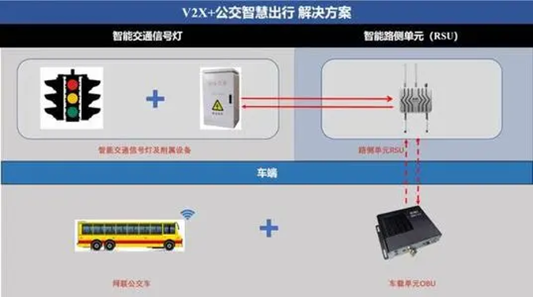

#### 车辆自动识别技术

> ETC系统中车辆自动识别技术是其中最重要的技术，它直接影响到系统的性能和应用推广，也是区别不同的ETC系统的主要标志。目前，采用的识别技术主要有:
>
> > **1.红外线扫描识别技术;**
> > **2.CCD摄像识别技术**
> > **3.激光扫描识别技术4IC卡识别技术等**
>
> 但由于交通运输本身特点要求有一种能够在全天候、恶劣环境下应用，远距离作用(10m左右)，安全可靠性高，高速，寿命长的系统。
> 微波非接触式ID卡识别技术就是适应这一需要而发展起来的。由于微波透人性强日以穿透浓雾、雨滴、风沙等，工作距离远，适合于车辆全天候、恶劣环境条件下工作具有工作距离远、体积小，既可以有源发射方式(寿命可达10年以上)也可以无源反射方式无寿命限制)工作，既可以主动式，也可以被动式工作，车辆以50-120km/h的正常速度通过收费站等特点。工作波段主要有900MIHz、2.45GHz和5.8GHz频段。

#### OBU与RSU间的通信频段

> ETC系统中，OBU与RSU之间采用专用短程通信标准协议(DSRC)进行半双工通信由于900MHz和2.45GHZ波段靠近移动通信波段且背景噪声千扰较大，国际上正趋于将5.8GHz的系统作为标准ETC系统使用。如美国采用900MHz或58GHz，日本和欧洲均规定5.8GHz作为ETC的频段
> 中国ISO/TC204技术委员会已提出将5.8GHz频段分配给ITS领域的短程通信，包括ETC系统，并批准在5.8GHz频段上进行ETC系统的试验，通信距离为10m。采用5.8GHz微波波段与中国ISID工业用波段一致，不受移动通信影响。目前国内使用的ETC系统频段多为900MHz和2.4GHz频段。对于5.8GHz系统，国内还没有开发出相应系统。

#### ETC系统应用概述

> ETC不停车收费系统主要由**车辆自动识别系统、中心管理系统和其他辅助设施**等组成。
> ETC 车道主要由 **ETC 天线、车道控制器、费额显示器、自动栏杆机、车辆检测器**等组成。车辆在通过收费站时，通过车载设备实现车辆识别、信息写入 (入口)并自动从预先绑定的IC卡或银行帐户上扣除相应资金(出口)。

#### 车辆驶入高速过程介绍

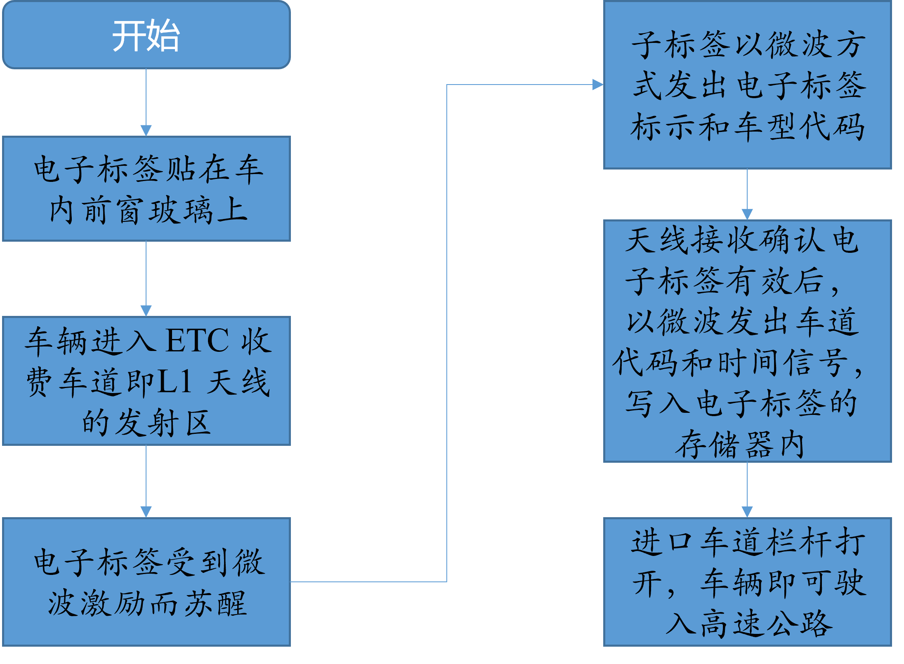

#### 车辆驶出高速过程介绍

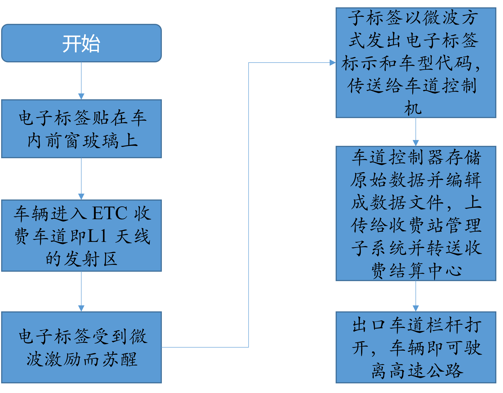

#### ETC车道布局示意图

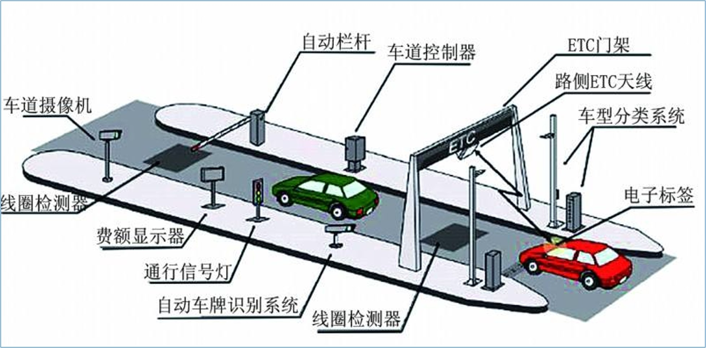

### 开发实践

#### 硬件设计

> 停车场不停车收费系统由PC机，嵌入式不停车收费设备，及900METC标签卡构成核心硬件为嵌入式不停车收费设备。硬件主要由两部分组成:CC2530节点与超高频读写器模块，通过CC2530节点的串口与PC机的上位机程序进行通讯。

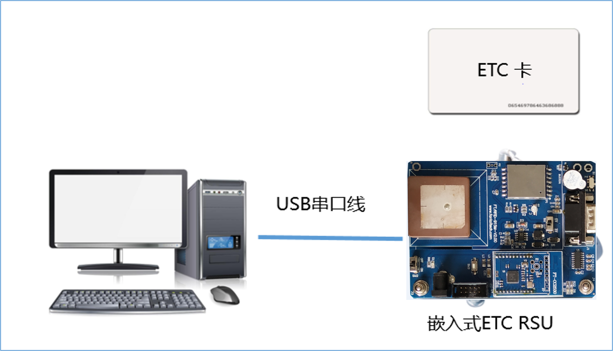

#### 软件设计

> 通过使用单片机与读写器实现停车场不停车收费，读写器读取用户信息，符合要求将发送消息到节点板，节点板接收到消息后就执行抬杆闭杆动作，再次刷卡时首先由读卡器对卡片进行扣费处理。扣费成功后将扣费成功的消息发送给单片机，单片机执行抬杆闭杆的操作.

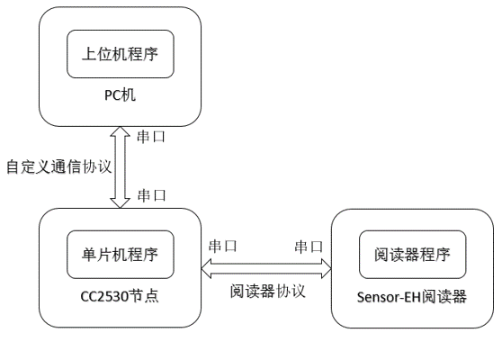

#### 单片机程序逻辑设计

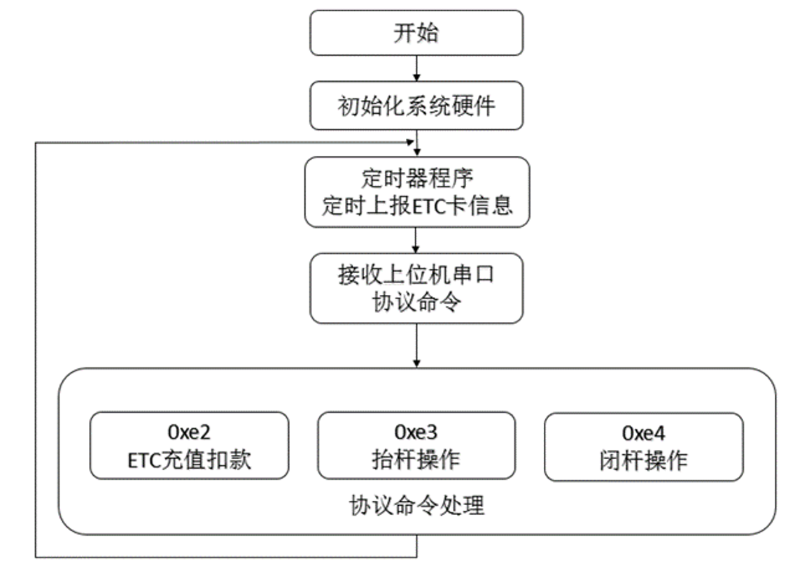

### 任务小结

#### 系统组成

> ETC主要由车辆自动识别系统、中心管理系统和其他辅助设施等组成。通过本任务城市ETC系统应用项目的学习，使用单片机、上位机超高频读写器和超高频电子标签模拟不停车收费系统的硬件，设计单片机的软件以实现不停车收费、充值、查余额的功能。掌握超高频RFID系统在城市ETC系统中的功能

#### 收费逻辑

> 收费逻辑:读写器搭载在单片机节点板上，上电后读写器读取电子标签信息，将标签卡号和余额发回到节点板，节点板接收到信息后发给上位机，上位机接收到信息，判断为奇数次读取则确定为入场，开始计算入场时间，单片机执行抬杆闭杆动作。再次读取到卡号信息时，发给上位机，上位机判断偶数次读取到用户信息时，则确定为离场，通过计算停车时间确定收费数，上位机计算原余额减去收费，得到需要下发的金额，发送给单片机，单片机将对读卡器发送写入数据的指令，对卡片进行写入新余额操作。写入成功后将扣费成功的消息发送给单片机，单片机执行抬杆闭杆的操作并将信息发送给上位机。

#### 充值逻辑

> 充值逻辑:读写器搭载在单片机节点板上，上电后读写器读取电子标签信息，将标签卡号和余额发回到节点板。确定金额，单击充值时，在上位机计算原余额与充值数目之和。将新的余额发送给单片机单片机对读写器发出写入数据的指令，读写器向卡片写入新的余额写入成功再读取新余额信息，返回上位机。

## 6.1 NFC识别技术与应用

### ==NFC原理与应用==

#### NFC近场通信概述

> 近场通信 (Near Field CommunicationNFC)又称近距离无线通信，是一种短距离的高频无线通信技术，允许电子设备之间进行非接触式点对点数据传输，交换数据。利用该技术，不同的电子设备可以轻松的实现在非接触的情况下进行通讯。而该技术也是由射频识别技术发展而来，并向下兼容非接触式射频识别技术，也就是RFID。早期，该技术是由索尼公司和飞利浦公司各自开发成功，主要为移动通信设备提供Machine toMachine的通信模式。由于近场通讯具有天然的安全性特点，自然在对安全性要求较高的移动支付等领域有广阔的应用前景。

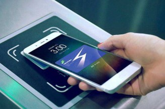

#### ==近场通信传输速度==

> 近场通信是一种短距离高频无线电技术，在**13.56MHz**频率运行于**10**厘米距离内。其传输速度有**106 Kbit/秒、212 Kbit/秒**或者**424 Kbit/秒**三种。目前近场通信已通过成为ISO/IEC IS 18092国际标准、ECMA-340标准与ETSI TS 102 190标准。


#### ==NFC技术标准==

> NFC 技术中的**编码、速率、调制方式、格式等底层的通信原理**由NFCIP-1标准规定。在NFCIP-1 中详细明确和规定了上述**传输协议**，其中包括 NFC**主动及被动模式下的数据冲突控制、协议启动以及数据交换**等。至于NFCIP-2则对NFC的**三种模式，即主动模式被读模式以及点对点模式**的网关系统做了明确制定。


#### ==模块组成==

> ​       NFC模块由**NFC芯片和NFC天线**组成。NFC芯片具有相互通信功能、计算能力，并具有加密和解密模块（SAM），NFC天线是一种**近场耦合天线，耦合方式是线圈磁场耦合。**


#### ==NFC与RFID的区别==

> NFC技术起源于RFID，但是与RFID相比有一定的区别，主要包括以下内容：
>
> （1）工作频率：NFC--13.56MHz；RFID--有低频、高频（13.56MHz）及超高频。 
>
> （2）工作距离：NFC的工作距离理论上为0～20cm，RFID具有不同的频率，其工作距离从几厘米到几十米不等。 
>
> （3）工作模式：NFC同时支持读写模式和卡模拟模式。在RFID中，读卡器和非接触卡是独立的两个实体，不能相互切换。 
>
> （4）点对点通信：NFC支持点对点通信模式，RFID不支持点对点模式。
>
> （5）应用领域： RFID更多地被应用在生产、物流、跟踪、资产管理上，NFC则在门禁、公交车、手机支付等领域发挥巨大的作用。 
>
> （6）标准协议：NFC的底层通信技术兼容高频RFID技术（13.56MHz）的底层通信技术标准，因此在13.56MHz RFID的应用领域中，同样可以使用NFC技术来代替。

#### NFC与红外、蓝牙的区别

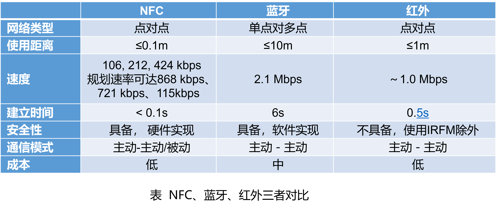

#### NFC

> NFC的短距离通信特性正是其优点，由于耗电量低、一次只和一台机器链接，拥有较高的保密性与安全性，NFC有利于信用卡交易时避免被盗用。NFC的目标并非是取代蓝牙等其他无线技术，而是在不同的场合、不同的领域起到相互补充的作用

#### ==NFC应用领域==

> NFC功能应用现在已经实现了电子支付、身份认证、票务、数据交换、防伪、广告等多个领域，NFC设备可以用作非接触式智能卡、智能卡的读写器终端以及设备对设备的数据传输链路。其应用广泛NFC应用可以分为四个基本类型:
> 接触、完成。诸如门禁管制或交通/活动检票之类的应用，用户只需将储存有票证或门禁代码的设备靠近阅读器即可。还可用于简单的数据撷取应用，例如从海报上的智能标签读取网址。接触、确认。移动付费之类的应用，用户必须输入密码确认交易，或者仅接受交易
> 接触、连接。将两台支持NFC的设备链接，即可进行点对点网络数据传输，例如下载音乐、交换图像或同步处理通信录等
> 接触、探索。NFC设备可能提供不止一种功能，消费者可以探索了解设备的功能，找出NFC设备潜在的功能与服务。

##### 金融支付

> 在国内，NFC在金融支付当中的应用是最为红火的，银联与中移动TSM搭建，招行、浦发、光大、广发等银行推出的手机钱包，各大巨头齐推的同时，也让人产生了一种错觉，NFC只应用在支付。无论褒贬，NFC 对金融支付行业的颠覆是无可厚非的

##### 交通

> 交通可以说是NFC 应用最为基础的功能，通过NFC 设备触碰闸机口的读卡区域，可以自动打开闸道，这是将城市交通卡的功能集成到NFC 设备之上，通过卡模拟实现。实际案例上，国内手机深圳通虽然使用的是2.4G 技术，技术实现上与NFC 有所不同，但使用方式都是一样的，而NFC 技术也可以在地铁公交的小额支付环境中应用。

##### 广告

> ​    NFC 标签因其可重复读写，并且一番变革。而NFC 则可以在这种情况下实现对二维码相关功能缺乏的互补。在动态时，NFC 更利于读取。 具体的NFC 广告方案可以参考微软光晕4游戏。宣传海报上带有NFC 标签以及二维码，两种方式互补，而且本活动最大的特点是第一个读取NFC 标签的玩家可以获得独一无二的奖励，而后续的读取者只能获得基本的宣传内容，这种宣传方式可以激起玩家的寻宝式热情，全城搜索NFC 广告以获得第一次读取的奖励。而且广告的深度浏览也加强不少，也是线上与线下、虚拟与现实活动的完美结合。在玩家读取标签之后，后台可以知道读取的次数，了解广告位的冷热程度，掌握数据之后广告公司可以合理的分布广告位，避免资源浪费。

##### 娱乐

> ​    娱乐行业首先介绍任天堂的Wii U 游戏主机，NFC 最大的一个卖点是线上与线下的有效对接，而游戏正是需要这样的方式来提高耐玩度，并且给玩家不一样的游戏体验。在虚拟游戏发布的同时，发布带有NFC 标签的玩偶，NFC 手柄可以读取玩偶上的NFC 标签，增加可玩角色，并且还可以通过NFC 玩偶将游戏中的数据带到另一个主机上，如U 盘数据的拷贝一般。

### ==NFC通信原理==

#### ==近场通信的技术原理==

> 近场通信的技术原理非常简单，它可以通过**主动与被动**两种模式交换数据。
> （1）在被动模式下，启动近场通信的设备，也称为发起设备（主设备），在整个通信过程中提供射频场(RF-field)。它可以选择106 kbps、212 kbps或424 kbps其中一种传输速度，将数据发送到另一台设备。另一台设备称为目标设备（从设备），不必产生射频场，而使用负载调制技术，以相同的速度将数据传回发起设备。
> （2）在主动模式下，发起设备和目标设备都要产生自己的射频场，以进行通信。

> 近场通信的传输距离极**短**，建立连接速度**快**。因此近场通信技术通常作为芯片内置在设备中，或者整合在手机的SIM卡或microSD卡中，当设备进行应用时，通过简单的碰一碰即可以建立连接。
>
> 例如在用于门禁管制或检票之类的应用时，用户只需将储存有票证或门禁代码的设备靠近阅读器即可；在移动付费之类的应用中，用户将设备靠近后，输入密码确认交易，或者接受交易即可；在数据传输时，用户将两台支持近场通信的设备靠近，即可建立连接，进行下载音乐、交换图像或同步处理通信录等操作。

#### ==NFC的两种通信模式==

##### 1）主动模式：

> 每台设备要向另一台设备发送数据时，都必须产生自己的射频场。如图所示，发起设备和目标设备都要产生自己的射频场，以便进行通信。这是对等网络通信的标准模式，可以获得非常快速的连接设置。


##### 2）被动模式:

> 启动NFC通信的设备，也称为NFC发起设备(主设备)，在整个通信过程中提供射频场。将数据发送到另一台设备。另一台设备称为NFC目标设备 (从设备)，不必产生射频场，而使用负载调制技术，即可以相同的速度将数据传回发起设备。


> 移动设备**主要以被动模式操作**，可以**大幅降低功耗**，并延长电池寿命。在一个应用会话过程中，NFC设备可以在发起设备和目标设备之间切换自己的角色。利用这项功能，电池电量较低的设备可以要求以被动模式充当目标设备，而不是发起设备。
>
> 目前，常见的NFC工作模式就是被动模式。例如，刷手机乘公交、购物等，这些都是将NFC终端则模拟成一张卡片，它只在其他设备发出的射频场中被动响应。主动模式常见于读取NFC标签信息等，双向模式多用于信息交换，例如交换名片。


#### ==NFC的三种操作模式==

> 基于主动通信和被动通信，NFC终端主要有三种工作模式：
>

##### 1）**读卡器模式**

> 在该模式下NFC终端作为一个读卡器，发出射频场去识别和读/写别的NFC设备信息。比较常见的应用就是公交卡余额的查询、充值等操作。数据在NFC芯片中，可以简单理解成“刷标签”。


##### 2）**卡模式**

> 这一模式其实就是替代大量的 IC 卡。其本质在于运用程序去模拟卡的功能，用软件去替代实物。将相应IC卡中的信息凭证封装成数据包存储在支持NFC的外设中。这个模式NFC终端则被模拟成一张卡，它只在其他设备发出的射频场中被动响应，被读/写信息。


##### 3）**双向模式**

> 在此模式下NFC终端双方都主动发出射频场来建立点对点的通信。相当于两个NFC设备都处于主动模式。用于数据交换，只是传输距离较短，创建速度较快，传输速度也很快，功耗低。主要用途在于蓝牙配对、Wi Fi 配对、手机间数据传递等。

#### NFC协议标准

> NFC技术标准包含四层，从底往上分别是
>
> > (1) RFLaver ISO (射频层)
> > (2) Mode Switch (模式切换层)
> > (3) NFC Protocol(NFC协议层);
> > (4) Applications (应用层)。
> >
> > > NFC标准规范是射频层的通信标准，包括ISO 14443(A/B)，NFCIP1.MIFARE,Felica等标准

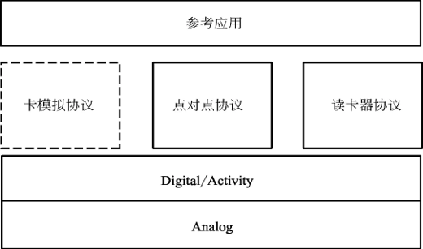

### ==常用NFC读写器与卡片==

#### 常用 NFC 芯片

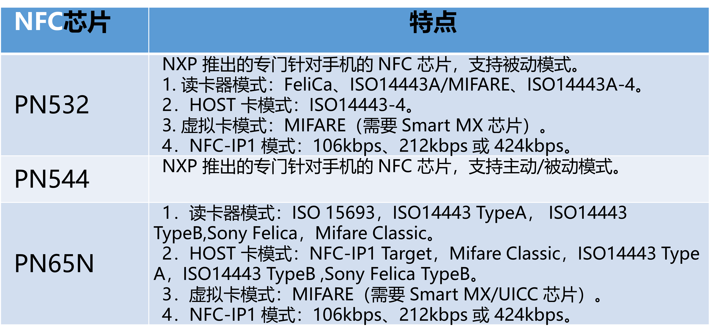

#### 常用卡芯片

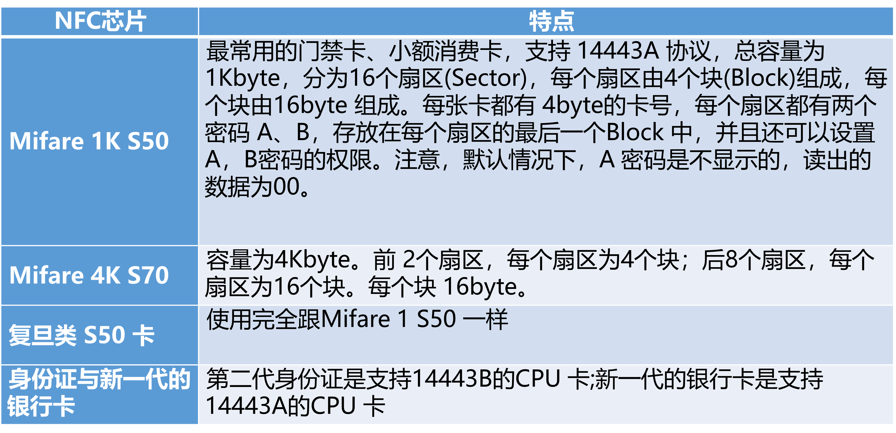

#### NFC常见阅读器形式

> NFC读写器是具有读取NFC标签功能的专用读卡设备。因此NFC读写器能够读到所有的NFC标签才能算真正的NFC读写器。NFC标签大致分为： ISO14443-A,B、TOPAZ、MIFARE和Felica。

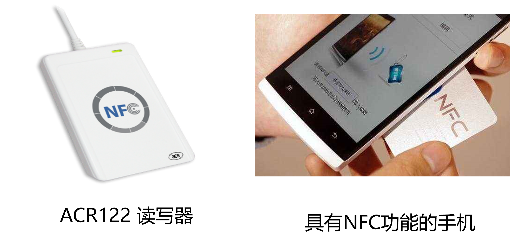

#### NFC常见卡片形式

> NFC标签核心就是一个很薄的像纸片一样的东西，里面是线圈。NFC定义的基本标签类型有四种，各有不同的格式与容量。这些标签类型格式的基础是:ISO14443的A与B类型、Sony FeliCa，前者是非接触式智能卡的国际标准，而后者符合ISO18092被动式通讯模式标准

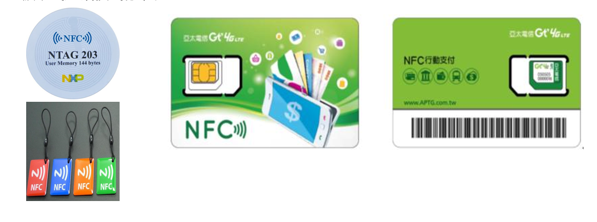

## 6.2 CPU卡识别与应用

### CPU卡系统概述与应用

#### CPU卡识别技术特点

> ​    非接触式CPU卡卡内集成电路中包括**中央处理器（CPU）、只读存储器（ROM）、随机存取存储器(RAM)、电可擦除可编程只读存储器（EEPROM）以及片内操作系统COS**等，犹如一台超小型电脑。

> **优点：**
>
> 信息量大
> 防伪安全性高
> 可脱机作业
> 可多功能开发

> 非接触式CPU卡采用了无线传输的方式，工作在**13.56MHz**


#### 安全性

> CPU卡采用了多种芯片级防攻击手段，基本上不可伪造
> 能够在内部进行加解密运算，它所特有的内外部认证机制以及以金融IC卡规范为代表的专用认证机制，能够完全保证交易的合法性;
> 在认证和交易过程中，CPU密钥不会泄露到卡外部，**每次都是通过加密的随机数来进行**，而且因为有随机数的参加，确保每次传输的内容不同，保证了交易的安全性在认证和交易过程中所使用的密钥都是在安全的发卡环境中产生并密文安装到一种特殊的存储了密钥和加解密算法的CPU卡和用户卡中，整个过程密钥不外露。
> 采用非接触式CPU卡可以杜绝伪造卡、伪造终端、伪造交易，最终保证了系统的安全

#### CPU卡与IC卡关系和区别

> CPU卡是IC卡大家族中的一员。IC卡是集成电路卡（Integrated Circuit Card）的简称，是镶嵌集成电路芯片的塑料卡片，其外形和尺寸都遵循国际标准（ISO）。芯片一般采用不易挥发性的存储器（ROM、EEPROM）、保护逻辑电路、甚至带微处理器CPU。CPU卡是含有微处理器的IC卡，**拥有独立的CPU处理器和芯片操作系统**，可以更灵活地支持不同的应用需求，提高了系统的安全性。
> 按照嵌入集成电路芯片的形式和芯片类型的不同IC卡大致可分为接触式，非接触式、双界面卡。如图所示：


> 数据结构方面，前面学习过的IC卡，它的要点在于卡的存储结构，如制**造商区、密码区、数据控制区、数据区（应用区）**等等。而CPU卡，要关注文件系统的结构：主文件（MF，相当于DOS文件系统的根目录）、专用文件（DF，相当于DOS文件系统的目录，可以有多层）、基本文件（EF，相当于DOS文件系统的文件）。

> CPU卡的基本文件类型有**透明（二进制）文件、（定长与不定长）线性记录文件和循环记录文件**三类，由于COS内部控制的需要，也派生出一些特定的“变种”——复位应答文件、口令文件、密钥文件、DIR文件、SFI文件……

> 读取方面，纯粹的存储卡是可以自由读取的；逻辑加密卡的访问控制，需要掌握特定的卡的口令控制、认证控制、特定的数据控制标志字节等，可通过调用函数直接完成的，需要熟悉调用参数。
> 而**CPU卡的访问控制，是在建立文件时定义**的，比如读、写、更改分别是否需要认证，用哪个密钥，是否需要口令，是否需要MAC验证等等。CPU卡除了设备命令（测卡、上下电、选卡座等）和卡的复位命令以外，所有卡命令都是通过一个通用的命令函数执行的，可参考COS手册。

#### 常见应用

> 由于非接触式CPU卡具有以上优点，**非常适用于电子钱包、电子存折公路自动收费系统、公共汽车自动售票系统、社会保障系统、IC卡加油系统安全门禁**等等众多的应用领域。

>    CPU卡的应用防火墙功能可以保障同一张卡中不同应用的安全独立性。对安全性要求较高的金融行业都以CPU卡作为下一代银行卡的标准。**银行的IC卡是接触式CPU卡**，如图4.58所示。支持《中国人民银行PBOC2.0标准》以及《建设部IC卡应用规范》。

### CPU卡工作原理

#### CPU卡的射频识别原理

> CPU卡的射频识别原理是**读卡器向电子标签发送命令**。经电子标签的天线进入射频模块。信号在射频模块中被发现后，被传送到操作系统中。操作系统程序模块是以代码的形式写入ROM的。并在芯片生产阶段写入芯片之中，操作系统的任务是对电子标签完成指令序列的控制、文件管理及加密算法。

> CPU卡射频识别设备工作于**13.56MHz**频段，系统通过天线线圈电感耦合来传输能量，通过电感耦合的方式磁场能量下降较快。磁场信号具有明显的读取区域边界。主要应用于1米以内的人员或物品的识别。

#### COS片内操作系统

> COS的全称是Chip Operating System(片内操作系统)，它一般是紧紧围绕着它所服务的智能卡的特点而开发的。首先，COS是一个专用系统而不是通用系统。即：**一种COS一般都只能应用于特定的某种(或者是某些)智能卡，不同卡内的COS一般是不相同的，但大部分都遵循着同一个国际标准。**
>
> 其次，与那些常见的微机上的操作系统相比较而言，<u>COS在本质上更加接近于监控程序、而不是一个通常所谓的真正意义上的操作系统</u>，COS所需要解决的主要还是**对外部的命令如何进行处理、响应的问题**，并不涉及到共享、并发的管理及处理。由于不可避免地受到了智能卡内微处理器芯片的性能及内存容量的影响，因此，COS在很大程度上不同于通常所能见到的微机上的操作系统(例如DOS、UNIX等)。

#### FMCOS简介

> 上海复旦微电子股份有限公司开发的自主版权的 CPU 卡操作系统FMCOS( FMSH Card Operating System )，该操作系统符合ISO 7816 系列标准及《中国金融集成电路 (IC)卡规范》，适用于保险、医疗保健、社会保障、公共事业收费安全控制、证件、交通运输等诸多应用领域，特别是在金融领域。FMCOS 详细规定了电子钱包、电子存折和磁条卡功能 (Easy Entry)三种基本应用

#### FMCOS特点

> 1)支持Single DES、Triple DES算法
> 2)支持线路加密、线路保护功能
> 3)支持电子钱包功能
> 4)支持多种文件类型
> 5)支持ISO14443-4
> 6)满足银行标准

### CPU卡读写器和CPU卡片

#### CPU卡

>    CPU卡是IC卡的一种，外形与之前学习的IC、ID卡标准卡片形状一样。非接触式CPU卡常用卡片芯片型号：FM1204、FM1208、FM1216、FM12DE32、SHC1108 、CIU5108A/B 、MIFARE DESfire 2K、MIFARE DESfire 4K、MIFARE DESfire 8K、MIFARE PRO等。芯片存储量：4K、8K、16K、32K、64K等。

#### 750系列读卡器

> 该读写器基于13.56MHz无线非接触式通信模式符合IS14443A、ISO14443BSO15693协议标准。硬件上采用32位ARM内核处理器、专业射频处理集成电路，软件上对协议、算法都进行了仔细的优化，能稳定、高速地完成对卡片的读写操作。该读写器采用USB-HID 免驱接口与PC机进行连接通信。

#### CPU卡:FM12208M01

> FM12208M01卡是单界面非接触CPU卡，支持ISO14443-A协议，CPU指令兼容通用8051指令，内置硬件DES协处理器，数据存储器为8Kbyte的EEPROM。FM12208M01符合银行标准，COS同时支持PBOC2.0标准(电子钱包)及建设部IC卡应用规范，具有较好的安全性。FM12208M01卡包括模拟电路、数字电路和存储器

#### 任务小结

> CPU卡芯片内含有一个微处理器，CPU卡可适用于金融、保险、交警、政府行业等多个领域，具有用户空间大、读取速度快、支持一卡多用等特点，并已经通过中国人民银行和国家商秘委的认证。CPU卡从外型上来说和普通IC卡，射频卡并无差异，但是性能上有巨大提升，安全性和普通IC卡比，提高很多，通常CPU卡内含有随机数发生器，硬件DES，3DES加密算法等，配合操作系统即片上OS，也称SoC，可以达到金融级别的安全等级。本任务CPU卡原理与操作项目，使用FM1208软件对CPU卡进行读写，密钥认证，掌握COS系统下外部认证，CPU卡内部的定长文件、二进制文件建立方法、密钥认证方法。

## 7.2 2.4G有源RFID仓储系统应用

### ==2.4G RFID与仓储管理==

#### 微波RFID概述

> 仓储是物流系统的一部分,是在原产地、消费地或者在这两地之间存储包括原材料、在制品、成品等仓储物品,并且向管理者提供有关存储仓储物品的状态、条件和处理情况等信息。电子标签技术在国外已成功应用于物流业，大大提高了仓储物流作业效率，在国内的应用还处于发展阶段

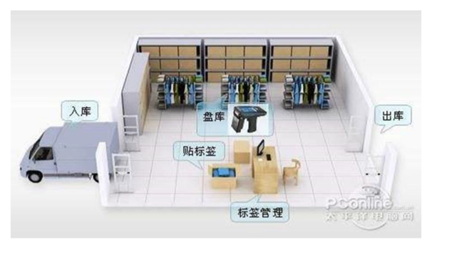

#### 仓储管理

> 仓库管理作业环节

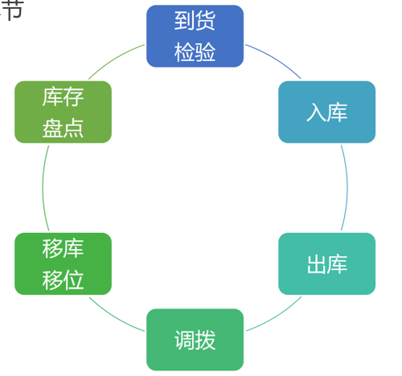

#### 2.4GRFID仓储应用

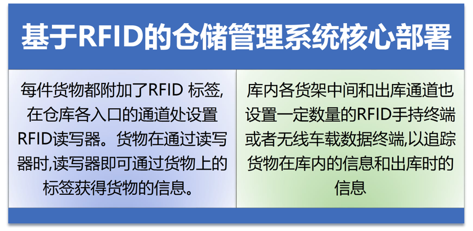

#### 2.4G仓储应用基本功能

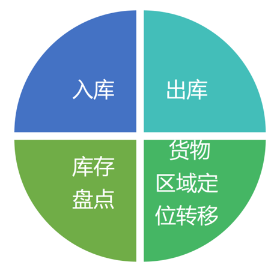

#### ==2.4G仓储应用基本功能==

##### (1)入库

> 当货物通过进货口传送带进入仓库时，每托盘货物信息通过进货口读写器写入托盘，然后通过计算机仓储管理信息系统运算出货位，并通过网络系统将存货指令发到又车车载系统，并可按照要求存放到相应货位

##### (2)出库

> 又车接到出货指令，到指定货位叉取托盘货物。又取前又车读写器再次确认托盘货物准确性，然后将托盘货物送至出货口传送带，出货口传送带读写器读取托盘标签信息是否准确，校验无误出货

##### (3)库存盘点

> 仓库内读写器实时读取在库货物标签信息，核对实时盘点数据与数据库中统计的仓储信息是否一致

##### (4)货物区域定位，转移

> 仓库内读写器实时读取货物标签信息，控制中心根据读卡器网络判断各个货物存放区域，统计仓库使用情况，并据此安排新入库货物存放位置

#### ==2.4G仓储应用==

##### ==硬件系统==

> (或称货2.4G有源RFID仓储系统主要包括若干2.4G有源RFID电子标签物托盘或智能卡)和(收发)读写器
> 系统的电子标签和读写器，使用的是无需申请的2.4GISM免费频段读写器可以远距离识别仓库内的所有的货物托盘，与电子标签保持通信实时上报数据。==丢失货物可以被及时发现。读卡器主要功能为读取电子标签，并通过无线/有线方式将读卡信息发送到系统控制器==

#### 设计思路

> 生产线下线的产品或其他货物，在入库前，将其按照物品本身的特性，安装匹配的RFID货物标签，货物标签记录货物的信息。
> 安装好货物标签后，将按照规则摆放，等待入库;入库口安装RFID通道式读取设备，入库时完成对货物标签信息的批量读取并上传到后台管理系统，完成货物的批量入库:货物进入仓库后，将按规格进行分类，放入相对应种类的仓储地，并为每个仓储地安装一个标识牌，给每一标识牌上贴上电子标签，该标签将作为库位标签。并且给每个标识牌编号，库位标签中存储能够唯一标识此货架的ID号，通过工作人员手持RFID手持机，读取标签上的ID号码，可调用后台系统数据库，获取其中的存储信息，信息包括:物品的种类、名称、型号、单位、单价、生产日前、保质期、性能等;
> 在移库操作时，工作人员持手持RFD手持机，系统发送移库指今到移动数据采集器上，移库人员找到指定的货位，从库位上取出指定数量的货物，并把货物运到目的库位，货物送入库位，修改货架标签内容，向后台系统发回移库作业信息。
> 在进行库房管理作业时，读取该标签编号，就可判定当前作业的位置是否正确。此外，只要输入某一货架的ID号即可从后台数据库调取该ID的相关信息，从而实现物资保管功能。
> 货物出库与入库是同样的流程，对出入库是同一个大门的，RFID读取设备可以复用，RFID读取设备扫描出库的所有货物信息将货物信息实时上传到后台系统，完成货物的出库操作。

#### 系统框架

> 基于RFID的仓库管理系统是在现有仓库管理中引入RFID技术，对仓库入库、出库、移库移位库存盘点等各个作业环节的数据进行自动化的数据采集，保证仓库管理各个环节数据输入的速度和准确性，确保企业及时准确地掌握库存的真实数据，合理保持和控制企业库存。


#### 作业流程

##### 标签初始化

> 该环节是对货物标签和库位标签进行初始化发卡，根据企业物料编码规则，对货物标签和库位标签进行编码，利用RFID标签打印机，将编码信息写入电子标签中，对需要打印信息的，同时可以在标签上打印库位编码文字或条码信息等数据。
> 完成标签编码并写入后，按照标签安装指导将标签安装到货物和库位上

#### 作业流程

##### 出入库

> 货物安装好货物标签后，将经过入库口进行入库作业。入库口部署RFID读取设备，读取货物标签RFID读取设备将批量读取到此次入库所有货物上的标签信息，并将标签信息上传到后台系统，后台系统将完成标签信息对应货物的入库操作。在进入到仓库后，将使用RFID手持机完成货物信息与入库仓位信息的绑定仓管人员在将货物放到货位上后，读取货位标签和货物标签，完成两者的绑定，同时将绑定信息上传到后台，整个入库流程完成。
> 出库是反向操作流程，货物从货位上被清理出来并执行出库，在通过出库口RFID读取设备时，将会被读取到所有货物的标签信息，并将信息上传到后台管理系统，后台管理系统将执行这些信息与出库单信息的核对正确将提升可以正常出库，完成货物的出库流程

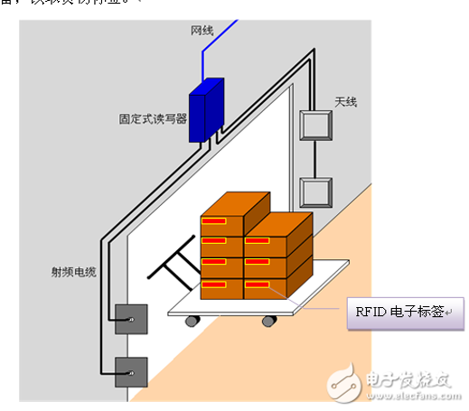

##### 移库

> 当一批货物出库配送工作完成接近尾声，库存不多时，又或收到下一批大宗货物入库通知时，需要进行移库，腾出库位以备新的货物用。此时，使用RFID手持机执行移库操作。RFID手持机第一步是读取需要进行移库的货物所在库位的库位标签，然后将货物转移到目标库位后，使用RFID手持机读取新库位的库付标签，后台系统自动进行新库位信息的更新，完成移库操作。

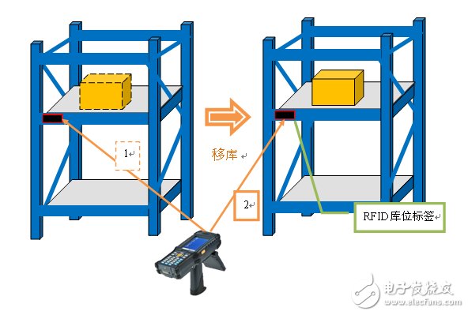

### 项目分析

#### 仓储管理系统

> 基于RFID技术的仓储管理系统工作时主要由PC机(运行上位机管理软件)，通过串口连接2.4G阅读器，对周围的2.4G智能标签进行寻找 (建议2个以上的智能标签)，对寻到的智能标签进行出入库管理。

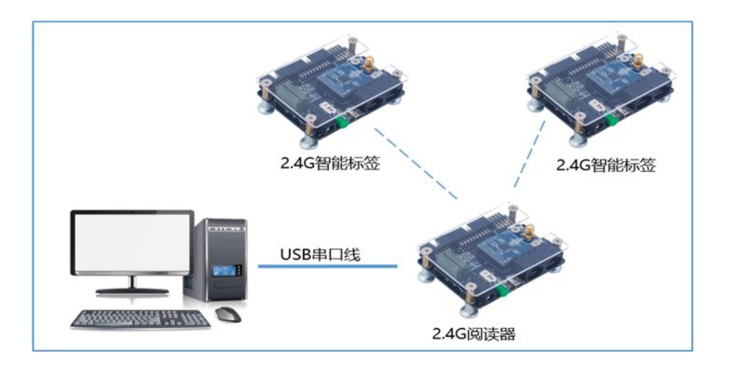

#### 入库管理入库管理:

> 显示寻到的2.4G标签，显示标签地址，选中标签地址条目点击入库按钮弹出入库信息窗口。输入货品信息。出库管理:列表控件显示入库的标签信息条目，选中对应卡号条目，点击出库按钮，删除入库标签信息。

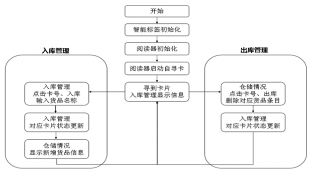

#### 数据处理

> 部分程序:无线数据处理

```c
void rfPoll(void)
static uint8 rxBufl1281:
uint8 r =basicRfReceive(rxBuf sizeof rxBuf, NULL):if (r > 0 && packageValidate(rxBuf, r) == 0) [uart1Sendbuf((char*)rxBuf, r);
ledOnTm(1, 50);}
```

### 项目实现

#### 程序验证

> 1. 2.4G模块下载不同程序，通过USB串口同上位机的2.4G无线仓储系统
>
> 应用进行通信。应用界面如下：

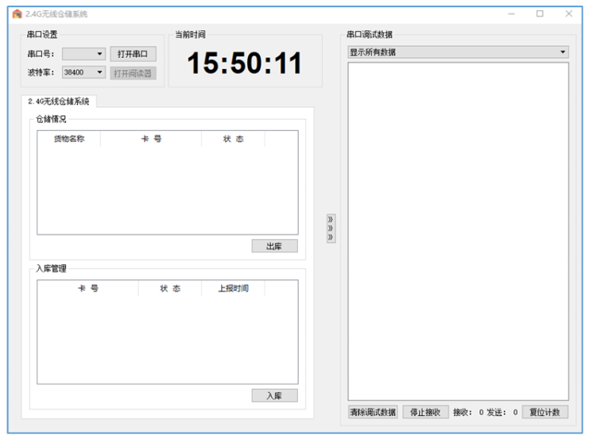

> 2.连接串口就开始自动寻卡，阅读器开始寻卡后，调试串口会定时显示寻卡操作信息，如果有智能标签卡被寻到，会显示返回的协议命令信息。同时入库管理控件界面会更新显示卡片的卡号、状态、上报时间。

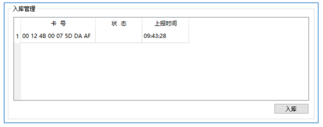

> 3.选择对应的卡片条目，点击入库按钮会弹出货物名称绑定对话框，输入卡片标签对应的货物名称。


> 4.仓储情况控件界面会显示，入库货品信息。入库管理界面的卡片条目会更新状态为已库存。如果想货品出库，在仓储情况选中对应的货物名称，点击出库按钮可完成出库操作。

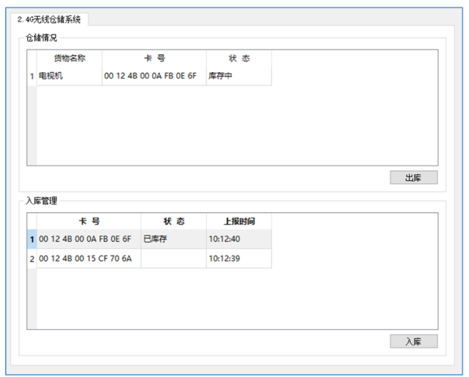

### 71微波2.4GRFID系统

### ==微波RFID概述==

> 2.4GHzISM(Industry Science Medicine) 是全世界公开通用使用的无线频段，典型技术有蓝牙、ZigBee、无线局域网Wi-Fi 等。包括射频识别(RFID)技术的各种无线产品均可使用此频段。2.4G射频系统的电子标签一般为主动式微型、微功耗电子标签，其信息实时性强、数据容量大、读写速度快、读取距离远，适用于人员、物品跟踪定位系统等领域


#### RFID技术中微波频段通常所用频率是

> **433MHz,860~960MHz，2.45GHz，5.8GHz**。在物流、供应链管理、高速公路收费、门禁等领域广泛应用
> ·工作距离:具有较远的读写距离，通常为大于**1m。**
> ·合方式:多采用**反向散射方式**而不是电感合方式，主动式应答器还可无线通信等。
> 应答器功能:还**可集成有传感器**，例如温度传感器、应力传感器等
> 天线:应答器天线**尺寸较小**。
> ·防碰撞:必须有**较快、有效**的处理碰撞的能力

>微波应答器基本电路组成和其它频段的RFID应答器相同，特点是工作频率高、作用距离远，因而能量获取和信息传送的方式上有所不同能量获取:
>
>> 1)从射频能量获得:
>> (2应答器带有附加电池，但仅提供芯片运转能量，通信能量仍通过射频获得;
>> 3)所带电池提供芯片运转和通信所需的能量。
>> **信息传送方式:基于反向散射原理的反射调制**

#### 2.4G接口标准

> ISO/IEC空中接口标准
>
> > 空中接口标准采用ISO/IEC18000标准ISO/IEC18000-7是433 MHz标准
> > ISO/IEC18000-6是860~930MHz标准ISO/IEC18000-4是2.45 GHz标准
>
> 行业标准
>
> > EPCglobal
> > UIC (Ubiquitous ID Center)


#### ==2.4GRFID的应用领域==


#### 2.4G标签


#### 微波RFID技术

> 基本元的辐射
>
> > 天线可分割为无限多个基本元，元上载有交变的电流和磁流基本元上的电(磁)流的振幅、相位和方向均假设是相同的基本元可分为三类:电流元、磁流元和面元。
> > 电流元上载有交变电流，称为电基本振子。
> > 磁流元上载有交变磁流，称为磁基本振子。

#### RFID系统常用天线


> 微带天线的结构一般由介质基板、辐射体及接地板构成。介质基板的厚度远小于波长，基板底部的金属薄层与接地板相接，正面则通过光刻工艺制作具有特定形状的金属薄层作为辐射体。辐射片的形状根据要求可进行多种变化


#### ==微波RFID通讯原理==

##### 1.基本电路


##### 2.能量获取

> 1)从射频能量获得
> 2)应答器带有附加电池，但仅提供芯片运转能量通信能量仍通过射频获得;
> 3)所带电池提供芯片运转和通信所需的能量


##### 3.信息传送方式

> 基于反向散射原理的反射调制，电磁反向散射耦合。应用的是雷达原理模型，发射出去的电磁波，碰到目标后反射，同时携带回目标信息。
>  识别作用距离大于1m，典型作用距离为3~10m。

#### ISO/IEC18000-4标准

> ISO/IEC18000-4定义了无线射频识别技术(RFID) 在2.5 GHz的工业，科学和医疗 (ISM)，用于项目管理应用带的空中接口设备的操作.ISO/IEC18000-4定义了正向和返回链路参数技术属性。包括:工作频率、工作通道的准确性、占领信道带宽、最大EIRP、杂散信号、调制占空比、数据编码、比特率、比特率精度、位传输顺序，并在适当的经营渠道支持跳频速率、跳序列、扩频序列和芯片率属性

#### 项目分析

##### CC2530的芯片结构

> CC2530芯片是一个拥有增强型51内核集成了无线发射模块，工作在2.4G频段下的无线传输芯片。通过使用官方提供的库文件可以实现2.4G微波频段下的数据传输。通过单片机程序使CC2530核心板在2.4G频段下识别并且发送和接收数据，模拟RFID读写器和电子标签的微波通信。


##### CC2530芯片频段分布

> CC2530芯片工作在2.4G至2.48G微波频段之间，为了保证同一区域的CC2530芯片信号不发生串扰，CC2530在设定频率时将2.4G频段拆分为了16个信道，信号拆分如下图所示


##### CC2530的信道及配置

> 下图将CC2530芯片的2.4G到2.48G之间的频段分频分为了16个信道-为了保证同信道间的CC2530芯片发送的数据进行区分，CC2530在网络信息设置时还需要配置相应的ID号，只有同信道和同ID号下的CC2530芯片可以实现数据传输。
> 为了保证CC2530芯片间能够实现数据交流只需要将两个CC2530芯片的网络参数配置为一致即可，通过修改相同和不同的网络参数用以了解工作在2.4G微波频段的模块的识别与隔离特性


#### 软件设计

##### 微波系统的组成

> 硬件设计:由两个(或两个以上) cc2530芯片模块、PC机组成。一系统连线图


##### 软件设计

> 两个CC2530芯片，一个模拟射频读写器，从PC端下发指令读取编组和信道，以及寻卡和向标签的数据块读取和写入数据。另一个模拟电子标签负责接收数据

#### 标签程序流程

> CC2530节点的标签程序流程


#### 阅读器流程

> CC2530节点的阅读器程序流程


#### 无线参数配置

> 部分程序:无线配置参数nv初始化: 信道16，编组1234

```c
void configlnit(void)
uint16 pid = 1234;
uint8 ch = 16;
osal nv item init(NV ID PANID, NV LEN PANID, &pid);osal nv item init(NV ID CHANNEL, NV LEN CHANNEL, &ch);
```

#### 实验

> 1.分别下载标签程序和读写器程序到单片机中，用usb连接对应的模块，打开RFIDDemo程序


> 2.USB线连接标签模块，标签功能区点击读取按钮。标签ID、编组、信道都会出现。注意标签ID是CC2530节点板的MAC地址，全球唯一，不可改变。


> 3.选择阅读器功能区，再连上USB线到读写器节点板上。串口号和波特率自动设置。直接点击打开串口。


> 4.寻卡，能读到标签的ID号。


> 5.从阅读器这一界面向标签写入数据。如写入1111111111111111，再读取

